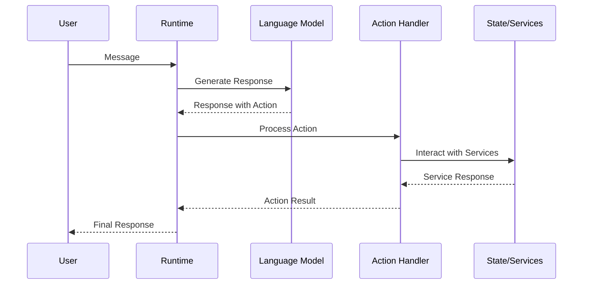

# Action Runtime Operation

## Overview

Actions are the primary way Eliza agents interact with the world. They represent discrete operations that an agent can perform in response to user input. Unlike providers (which supply context) or evaluators (which validate responses), actions are the mechanisms through which agents actually effect change in their environment.

## Action Architecture



## Action Interface

```typescript
interface Action {
    /** Similar action descriptions */
    similes: string[];

    /** Detailed description */
    description: string;

    /** Example usages */
    examples: ActionExample[][];

    /** Handler function */
    handler: Handler;

    /** Action name */
    name: string;

    /** Validation function */
    validate: Validator;
}

interface ActionExample {
    /** User associated with the example */
    user: string;

    /** Content of the example */
    content: Content;
}
```

## Action Lifecycle

### 1. Registration
```typescript
// In plugin definition
const myPlugin: Plugin = {
    name: "my-plugin",
    actions: [myAction],
    // ...other plugin properties
};

// Runtime registration
runtime.registerAction(action);
```

### 2. Validation
```typescript
const action: Action = {
    validate: async (runtime, message, state) => {
        // Validate action prerequisites
        const isValid = checkRequirements(message, state);
        return {
            pass: isValid,
            reason: isValid ? "Valid" : "Missing required data"
        };
    }
};
```

### 3. Execution
```typescript
const action: Action = {
    handler: async (runtime, message, state) => {
        try {
            // 1. Extract parameters
            const params = extractParams(message);
            
            // 2. Get required services
            const service = runtime.getService(ServiceType.DATABASE);
            
            // 3. Execute operation
            const result = await service.operation(params);
            
            // 4. Update state if needed
            await updateState(runtime, result);
            
            // 5. Return result
            return {
                success: true,
                data: result
            };
        } catch (error) {
            return {
                success: false,
                error: error.message
            };
        }
    }
};
```

## Runtime Processing

### Action Selection
```typescript
async processActions(
    message: Memory,
    responses: Memory[],
    state?: State,
    callback?: HandlerCallback
): Promise<void> {
    for (const response of responses) {
        // 1. Extract action from response
        const normalizedAction = response.content?.action
            .toLowerCase()
            .replace("_", "");

        // 2. Find matching action
        const action = this.actions.find(
            (a) => a.name.toLowerCase() === normalizedAction
        );

        // 3. Execute if found
        if (action) {
            await action.handler(this, message, state);
        }
    }
}
```

## Best Practices

### 1. Action Design
- Keep actions atomic and focused
- Use clear, descriptive names
- Provide comprehensive examples
- Include similar action references

### 2. Validation
```typescript
const robustAction: Action = {
    validate: async (runtime, message, state) => {
        // 1. Check prerequisites
        if (!state?.userId) {
            return {
                pass: false,
                reason: "User ID required"
            };
        }

        // 2. Verify permissions
        const canExecute = await checkPermissions(runtime, state.userId);
        if (!canExecute) {
            return {
                pass: false,
                reason: "Insufficient permissions"
            };
        }

        // 3. Validate parameters
        const params = extractParams(message);
        const isValid = validateParams(params);
        
        return {
            pass: isValid,
            reason: isValid ? "Valid" : "Invalid parameters"
        };
    }
};
```

### 3. Error Handling
```typescript
const reliableAction: Action = {
    handler: async (runtime, message, state) => {
        try {
            // Main operation
            const result = await performOperation();
            return { success: true, data: result };
        } catch (error) {
            // Log error
            runtime.logger.error("Action failed", {
                action: this.name,
                error: error.message
            });

            // Cleanup if needed
            await cleanup();

            // Return meaningful error
            return {
                success: false,
                error: "Operation failed",
                details: error.message
            };
        }
    }
};
```

### 4. State Management
```typescript
const statefulAction: Action = {
    handler: async (runtime, message, state) => {
        // 1. Read state
        const currentState = state?.operationState || {};
        
        // 2. Perform operation
        const result = await performOperation(currentState);
        
        // 3. Update state
        await runtime.messageManager.saveMemory({
            type: "operation_state",
            content: {
                ...currentState,
                lastOperation: result
            }
        });
        
        return { success: true };
    }
};
```

## Common Patterns

### 1. Service Integration
```typescript
const serviceAction: Action = {
    handler: async (runtime, message, state) => {
        // Get required services
        const database = runtime.getService(ServiceType.DATABASE);
        const cache = runtime.getService(ServiceType.CACHE);
        
        // Check cache first
        const cached = await cache.get(key);
        if (cached) return cached;
        
        // Perform database operation
        const result = await database.query(params);
        
        // Cache result
        await cache.set(key, result);
        
        return result;
    }
};
```

### 2. Chained Actions
```typescript
const chainedAction: Action = {
    handler: async (runtime, message, state) => {
        // 1. First operation
        const result1 = await firstOperation();
        
        // 2. Use result in second operation
        const result2 = await secondOperation(result1);
        
        // 3. Final operation
        return finalOperation(result2);
    }
};
```

### 3. Progressive Enhancement
```typescript
const enhancedAction: Action = {
    handler: async (runtime, message, state) => {
        // 1. Basic operation
        const basicResult = await basicOperation();
        
        // 2. Try enhanced features
        try {
            return await enhancedOperation(basicResult);
        } catch {
            // Fallback to basic result
            return basicResult;
        }
    }
};
```

## FAQ

### Q: When should I use an action vs a provider?
A: Use an action when you need to:
- Modify system state
- Perform external operations
- Handle user commands
- Execute multi-step operations

Use a provider when you need to:
- Supply context to the LLM
- Read (but not modify) state
- Format information for context

### Q: How do actions interact with state?
A: Actions can both read and modify state through:
1. Direct state object access
2. Runtime service operations
3. Memory manager interactions
4. External service calls

### Q: Can actions trigger other actions?
A: Yes, actions can trigger other actions, but be careful to:
1. Avoid circular dependencies
2. Handle errors properly
3. Maintain clear responsibility boundaries
4. Document action chains

### Q: How do I handle long-running actions?
A: For long-running operations:
1. Use async/await properly
2. Implement progress tracking
3. Consider breaking into smaller actions
4. Provide status updates
5. Handle timeouts gracefully

_Note: This FAQ will be updated with new Q&As from our ongoing discussions._
