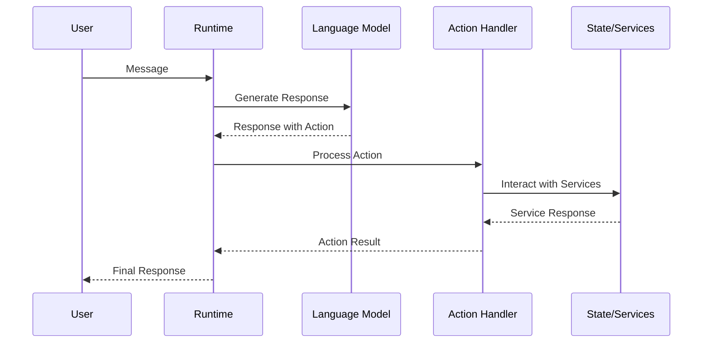

# Action Runtime Operation

## Overview

Actions are core building blocks in Eliza that define how agents respond to and interact with messages. Unlike providers (which supply context) or evaluators (which validate responses), actions are the mechanisms through which agents actually effect change in their environment. They allow agents to:

1. Interact with external systems
2. Modify their behavior
3. Perform tasks beyond simple message responses
4. Control conversation flow
5. Integrate with external services

## Action Architecture



## Action Interface

```typescript
interface Action {
    /** Unique identifier for the action */
    name: string;

    /** Alternative names/variations that can trigger this action */
    similes: string[];

    /** Detailed explanation of when and how to use this action */
    description: string;

    /** Example usage patterns */
    examples: ActionExample[][];

    /** Implementation of the action's behavior */
    handler: Handler;

    /** Function that checks if action is appropriate */
    validate: Validator;
}

interface ActionExample {
    /** User associated with the example */
    user: string;

    /** Content of the example */
    content: Content;
}
```

## Built-in Actions

### 1. Conversation Flow

#### CONTINUE
```typescript
const continueAction: Action = {
    name: "CONTINUE",
    similes: ["ELABORATE", "KEEP_TALKING"],
    description: "Used when the message requires a follow-up. Limited to 3 consecutive continues.",
    validate: async (runtime, message) => {
        const continueCount = await getContinueCount(runtime, message);
        return continueCount < 3;
    },
    handler: async (runtime, message, state) => {
        await incrementContinueCount(runtime, message);
        // Continue conversation logic
    }
};
```

#### IGNORE
```typescript
const ignoreAction: Action = {
    name: "IGNORE",
    similes: ["STOP_TALKING", "STOP_CHATTING"],
    description: "Used for graceful conversation disengagement",
    handler: async (runtime, message) => {
        // Mark conversation as complete
        await runtime.messageManager.saveMemory({
            type: "conversation_state",
            content: { status: "completed" }
        });
    }
};
```

### 2. External Integrations

#### TAKE_ORDER
```typescript
const takeOrder: Action = {
    name: "TAKE_ORDER",
    similes: ["BUY_ORDER", "PLACE_ORDER"],
    description: "Records trading/purchase orders with conviction levels",
    validate: async (runtime, message) => {
        const text = message.content.text;
        // Validate ticker symbols
        const tickerRegex = /\b[A-Z]{1,5}\b/g;
        if (!tickerRegex.test(text)) {
            return {
                pass: false,
                reason: "No valid ticker symbol found"
            };
        }
        // Check user permissions
        const hasPermission = await checkTradePermission(runtime, message);
        return {
            pass: hasPermission,
            reason: hasPermission ? "Valid" : "Insufficient permissions"
        };
    },
    handler: async (runtime, message, state) => {
        const order = extractOrderDetails(message);
        await runtime.getService(ServiceType.TRADING).placeOrder(order);
    }
};
```

## Action Lifecycle

### 1. Registration
```typescript
// In plugin definition
const myPlugin: Plugin = {
    name: "my-plugin",
    actions: [myAction],
    // ...other plugin properties
};

// Runtime registration
runtime.registerAction(action);
```

### 2. Validation
```typescript
const action: Action = {
    validate: async (runtime, message, state) => {
        try {
            // 1. Check prerequisites
            if (!state?.userId) {
                return {
                    pass: false,
                    reason: "User ID required"
                };
            }

            // 2. Verify permissions
            const canExecute = await checkPermissions(runtime, state.userId);
            if (!canExecute) {
                return {
                    pass: false,
                    reason: "Insufficient permissions"
                };
            }

            // 3. Validate parameters
            const params = extractParams(message);
            const isValid = validateParams(params);
            
            return {
                pass: isValid,
                reason: isValid ? "Valid" : "Invalid parameters"
            };
        } catch (error) {
            return {
                pass: false,
                reason: `Validation error: ${error.message}`
            };
        }
    }
};
```

### 3. Execution
```typescript
const action: Action = {
    handler: async (runtime, message, state) => {
        try {
            // 1. Extract parameters
            const params = extractParams(message);
            
            // 2. Get required services
            const service = runtime.getService(ServiceType.DATABASE);
            
            // 3. Execute operation
            const result = await service.operation(params);
            
            // 4. Update state if needed
            await updateState(runtime, result);
            
            // 5. Return result
            return {
                success: true,
                data: result
            };
        } catch (error) {
            runtime.logger.error("Action failed", {
                action: this.name,
                error: error.message
            });
            return {
                success: false,
                error: error.message
            };
        }
    }
};
```

## Runtime Processing

### Action Selection and Execution
```typescript
async processActions(
    message: Memory,
    responses: Memory[],
    state?: State,
    callback?: HandlerCallback
): Promise<void> {
    for (const response of responses) {
        if (!response.content?.action) {
            runtime.logger.warn("No action found in response");
            continue;
        }

        // 1. Normalize action name
        const normalizedAction = response.content.action
            .toLowerCase()
            .replace("_", "");

        // 2. Find matching action (including similes)
        const action = this.actions.find(
            (a) => [a.name.toLowerCase(), ...a.similes.map(s => s.toLowerCase())]
                .includes(normalizedAction)
        );

        if (!action) {
            runtime.logger.warn(`Unknown action: ${normalizedAction}`);
            continue;
        }

        // 3. Validate action
        const validation = await action.validate(this, message, state);
        if (!validation.pass) {
            runtime.logger.warn(`Action validation failed: ${validation.reason}`);
            continue;
        }

        // 4. Execute action
        try {
            await action.handler(this, message, state);
        } catch (error) {
            runtime.logger.error("Action execution failed", {
                action: action.name,
                error: error.message
            });
            if (callback) {
                await callback(error);
            }
        }
    }
}
```

## Best Practices

### 1. Action Design
- Keep actions atomic and focused
- Use clear, descriptive names
- Provide comprehensive examples
- Include similar action references
- Document side effects

### 2. Error Handling
```typescript
const reliableAction: Action = {
    handler: async (runtime, message, state) => {
        const transaction = await runtime.database.startTransaction();
        
        try {
            // Main operation
            const result = await performOperation();
            
            // Commit changes
            await transaction.commit();
            
            return { success: true, data: result };
        } catch (error) {
            // Rollback on error
            await transaction.rollback();
            
            // Log error
            runtime.logger.error("Action failed", {
                action: this.name,
                error: error.message
            });

            // Return meaningful error
            return {
                success: false,
                error: "Operation failed",
                details: error.message
            };
        }
    }
};
```

### 3. State Management
```typescript
const statefulAction: Action = {
    handler: async (runtime, message, state) => {
        // 1. Read state
        const currentState = state?.operationState || {};
        
        // 2. Perform operation
        const result = await performOperation(currentState);
        
        // 3. Update state atomically
        await runtime.messageManager.saveMemory({
            type: "operation_state",
            content: {
                ...currentState,
                lastOperation: result,
                timestamp: Date.now()
            }
        });
        
        // 4. Update runtime state
        Object.assign(state, {
            operationState: {
                ...currentState,
                lastOperation: result
            }
        });
        
        return { success: true };
    }
};
```

## Common Patterns

### 1. Service Integration
```typescript
const serviceAction: Action = {
    handler: async (runtime, message, state) => {
        // Get required services
        const database = runtime.getService(ServiceType.DATABASE);
        const cache = runtime.getService(ServiceType.CACHE);
        
        // Check cache first
        const cacheKey = generateCacheKey(message);
        const cached = await cache.get(cacheKey);
        if (cached) return cached;
        
        // Perform database operation
        const result = await database.query(params);
        
        // Cache result with TTL
        await cache.set(cacheKey, result, {
            ttl: 60 * 60 // 1 hour
        });
        
        return result;
    }
};
```

### 2. Chained Actions
```typescript
const chainedAction: Action = {
    handler: async (runtime, message, state) => {
        // 1. First operation
        const result1 = await firstOperation();
        if (!result1.success) {
            return result1;
        }
        
        // 2. Use result in second operation
        const result2 = await secondOperation(result1.data);
        if (!result2.success) {
            // Rollback first operation if needed
            await rollbackFirstOperation(result1.data);
            return result2;
        }
        
        // 3. Final operation
        return finalOperation(result2.data);
    }
};
```

### 3. Progressive Enhancement
```typescript
const enhancedAction: Action = {
    handler: async (runtime, message, state) => {
        // 1. Basic operation
        const basicResult = await basicOperation();
        
        // 2. Try enhanced features if available
        if (runtime.hasService(ServiceType.ENHANCED)) {
            try {
                const enhancedResult = await enhancedOperation(basicResult);
                return {
                    ...enhancedResult,
                    enhanced: true
                };
            } catch {
                runtime.logger.warn("Enhanced operation failed, using basic result");
            }
        }
        
        // Fallback to basic result
        return {
            ...basicResult,
            enhanced: false
        };
    }
};
```

## FAQ

### Q: When should I use an action vs a provider?
A: Use an action when you need to:
- Modify system state
- Perform external operations
- Handle user commands
- Execute multi-step operations
- Control conversation flow

Use a provider when you need to:
- Supply context to the LLM
- Read (but not modify) state
- Format information for context
- Provide real-time data

### Q: How do actions interact with state?
A: Actions can both read and modify state through:
1. Direct state object access
2. Runtime service operations
3. Memory manager interactions
4. External service calls

The state modifications should be:
- Atomic where possible
- Properly rolled back on failure
- Documented in action description
- Reflected in runtime state

### Q: Can actions trigger other actions?
A: Yes, actions can trigger other actions, but follow these guidelines:
1. Avoid circular dependencies
2. Handle errors properly
3. Maintain clear responsibility boundaries
4. Document action chains
5. Consider using a dedicated orchestrator for complex chains
6. Implement proper rollback mechanisms

### Q: How do I handle long-running actions?
A: For long-running operations:
1. Use async/await properly
2. Implement progress tracking
3. Consider breaking into smaller actions
4. Provide status updates
5. Handle timeouts gracefully
6. Use background jobs for very long operations
7. Implement proper cleanup on failure

### Q: How should actions handle rate limits and quotas?
A: Implement robust rate limiting by:
1. Using runtime cache for quota tracking
2. Implementing exponential backoff
3. Providing clear error messages
4. Considering user-specific limits
5. Implementing circuit breakers for external services

_Note: This FAQ will be updated with new Q&As from our ongoing discussions._
