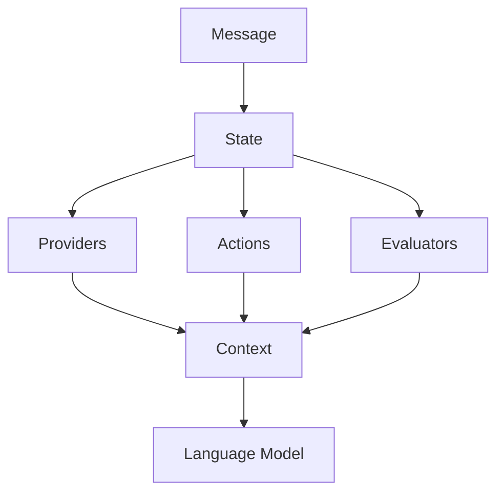
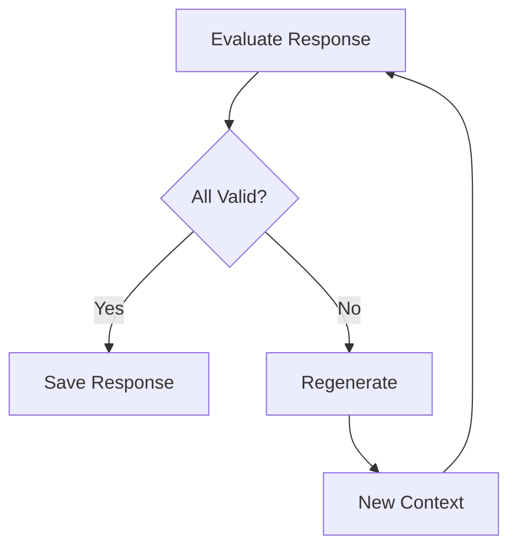

# Context Management in Eliza

## Overview

Context management is a core component of Eliza's architecture, enabling rich, contextual interactions between users and agents. This document explains how context is built, managed, and utilized throughout the system.



## Context Components

### 1. State Object
The [State](cci:1://file:///home/kai/eliza/eliza/packages/core/src/types.ts:1203:0-1224:1) interface forms the foundation of context management:

```typescript
interface State {
    userId?: UUID;
    agentId?: UUID;
    bio: string;
    lore: string;
    messageDirections: string;
    postDirections: string;
    roomId: UUID;
    agentName?: string;
    senderName?: string;
    actors: string;
    actorsData?: Actor[];
    goals?: string;
    goalsData?: Goal[];
    recentMessages: string;
    recentMessagesData: Memory[];
    actionNames?: string;
    actions?: string;
    actionsData?: Action[];
    actionExamples?: string;
    providers?: string;
    responseData?: Content;
    recentInteractionsData?: Memory[];
}
```

### 2. Context Generation
Context is composed through the [composeContext](cci:1://file:///home/kai/eliza/eliza/packages/core/src/context.ts:1:1-1:1) function:

```typescript
composeContext({
    state: State,
    template: string,
    templatingEngine?: 'handlebars'
}): string
```

## Component Responsibilities

### 1. Providers
Providers are responsible for enriching the context with dynamic information:

- **Role**: Bridge between knowledge base and conversation
- **Execution**: Run before action handlers
- **Context Contribution**: Return strings that get concatenated into final context

Example Provider Context Flow:
```typescript
class KnowledgeProvider implements Provider {
    async get(runtime: IAgentRuntime, message: Memory, state?: State) {
        // 1. Generate relevant context
        const context = await this.generateContext(message);
        
        // 2. Format for LLM consumption
        return `
        RELEVANT_KNOWLEDGE:
        ${context}
        `;
    }
}
```

### 2. Actions
Actions consume and potentially modify context:

- **Role**: Process messages with context awareness
- **Execution**: Run after providers
- **Context Usage**: Access full context through state object

Example Action Context Usage:
```typescript
const action: Action = {
    name: "processQuery",
    handler: async (runtime, message, state) => {
        // Access context from state
        const relevantContext = state.providers;
        const userPreferences = state.actorsData;
        
        // Use context to inform processing
        return processWithContext(message, relevantContext);
    }
};
```

### 3. Evaluators
Evaluators validate responses using context:

- **Role**: Ensure responses align with context
- **Execution**: Run after action handlers
- **Context Usage**: Validate response appropriateness

Example Evaluator Context Usage:
```typescript
const evaluator: Evaluator = {
    name: "contextConsistency",
    handler: async (runtime, message, state) => {
        // Check response against context
        const isConsistent = validateAgainstContext(
            message.content,
            state.recentMessages
        );
        
        return {
            pass: isConsistent,
            reason: isConsistent ? "Consistent with context" : "Context violation"
        };
    }
};
```

## Context Flow

1. **State Initialization**
   ```typescript
   const state = await runtime.composeState(message);
   ```

2. **Provider Context**
   ```typescript
   const providerContext = await getProviders(runtime, message, state);
   ```

3. **Action Processing**
   ```typescript
   const result = await action.handler(runtime, message, state);
   ```

4. **Evaluation**
   ```typescript
   const evaluation = await evaluator.handler(runtime, message, state);
   ```

## Best Practices

### 1. Context Formatting

```typescript
// Use clear section headers
return `
SECTION_NAME:
${content}

ANOTHER_SECTION:
${moreContent}
`;
```

### 2. Context Prioritization

```typescript
// Order by importance
const context = [
    criticalInfo,
    userPreferences,
    historicalContext,
    supplementaryInfo
].filter(Boolean).join('\n\n');
```

### 3. Context Validation

```typescript
function validateContext(context: string): boolean {
    // Check required sections
    const hasRequired = [
        'USER_CONTEXT:',
        'RECENT_MESSAGES:',
        'RELEVANT_KNOWLEDGE:'
    ].every(section => context.includes(section));
    
    // Check length
    const withinLimit = context.length <= MAX_CONTEXT_LENGTH;
    
    return hasRequired && withinLimit;
}
```

## Common Patterns

### 1. Dynamic Context Loading

```typescript
async function loadContext(runtime: IAgentRuntime, message: Memory) {
    // Load based on message content
    if (message.content.includes('weather')) {
        return await getWeatherContext();
    }
    if (message.content.includes('schedule')) {
        return await getScheduleContext();
    }
    return getDefaultContext();
}
```

### 2. Context Caching

```typescript
class CachedProvider implements Provider {
    async get(runtime: IAgentRuntime, message: Memory) {
        const cacheKey = `context_${message.id}`;
        
        // Check cache
        const cached = await runtime.cacheManager.get(cacheKey);
        if (cached) return cached;
        
        // Generate and cache
        const context = await generateContext(message);
        await runtime.cacheManager.set(cacheKey, context);
        
        return context;
    }
}
```

### 3. Stateful Context

```typescript
class StatefulProvider implements Provider {
    async get(runtime: IAgentRuntime, message: Memory, state?: State) {
        if (!state) return null;
        
        // Update conversation state
        state.conversationDepth = (state.conversationDepth || 0) + 1;
        
        // Return state-aware context
        return `
        CONVERSATION_STATE:
        Depth: ${state.conversationDepth}
        Topic: ${state.currentTopic || 'None'}
        `;
    }
}
```

## Debugging Context

### 1. Context Inspection

```typescript
function inspectContext(context: string) {
    const sections = context.split('\n\n');
    
    console.log('Context Analysis:', {
        totalLength: context.length,
        sectionCount: sections.length,
        sections: sections.map(s => ({
            name: s.split('\n')[0],
            length: s.length
        }))
    });
}
```

### 2. Context Validation

```typescript
function validateContextStructure(context: string) {
    const required = [
        'USER_CONTEXT:',
        'RECENT_MESSAGES:',
        'RELEVANT_KNOWLEDGE:'
    ];
    
    const missing = required.filter(
        section => !context.includes(section)
    );
    
    if (missing.length) {
        console.warn('Missing required sections:', missing);
        return false;
    }
    
    return true;
}
```

## Frequently Asked Questions

### Q: What's the difference between state and context?
A: State is the raw data structure containing all available information (like `userId`, `recentMessages`, etc.), while context is the formatted string that gets sent to the language model. Context is generated by processing the state through providers and formatting it according to templates.

### Q: How do I debug context-related issues?
A: There are several approaches:
1. Use the context inspection utilities shown in the Debugging section
2. Check provider outputs individually
3. Validate context structure before sending to LLM
4. Review the state object for missing or incorrect data
5. Enable debug logging for context generation

### Q: What's the recommended way to format provider output?
A: Use clear section headers and structured formatting:
```typescript
return `
SECTION_NAME:
- Point 1: ${data1}
- Point 2: ${data2}

CONTEXT:
${relevantContext}
`;
```

### Q: How do I handle context length limits?
A: Best practices include:
1. Prioritize recent and relevant information
2. Truncate or summarize long sections
3. Use embedding-based search to find most relevant context
4. Implement context window management
5. Cache frequently used context

### Q: Can providers access each other's context?
A: Yes, providers can access other providers' output through the state object's `providers` field, but they execute independently and in sequence. It's recommended to design providers to be self-contained to maintain modularity.

### Q: How do I maintain conversation state across multiple messages?
A: Use a combination of:
1. Memory managers to persist data
2. State management in providers
3. The `recentMessages` and `recentInteractionsData` in state
4. Custom state fields for specific needs

### Q: What's the relationship between actions and context?
A: Actions consume context but don't generate it. They:
1. Receive context through the state parameter
2. Can use context to inform their behavior
3. May modify state that affects future context
4. Can trigger state updates that influence subsequent provider runs

### Q: How do I handle errors in context generation?
A: Implement proper error handling:
1. Catch and log provider errors
2. Provide fallback context when providers fail
3. Validate context structure before use
4. Monitor context quality through evaluators
5. Use defensive programming in context parsing

### Q: How do providers, actions, and evaluators contribute to context?
A: They have different roles in the context lifecycle:
1. **Providers**: Generate context _before_ LLM interaction
   - Add knowledge, user preferences, conversation history, etc.
   - Return formatted strings that get added to the context
   - Run first in the pipeline

2. **Actions**: Don't generate context, but _use_ it during LLM interaction
   - Receive the full context through the state object
   - Can modify state that affects _future_ context
   - Run after providers, during LLM interaction

3. **Evaluators**: Validate context _after_ LLM response
   - Ensure response aligns with provided context
   - Can prevent responses that contradict context
   - Run last in the pipeline

### Q: What does it mean that "Actions consume context"?
A: When we say actions "consume" context, we mean they:
1. Read and utilize the context provided in the state object
2. Make decisions based on that context
3. Don't add to the immediate context sent to the LLM

Example:
```typescript
const weatherAction: Action = {
    name: "checkWeather",
    handler: async (runtime, message, state) => {
        // "Consuming" context by reading user preferences
        const userPrefs = state.actorsData?.find(
            a => a.id === state.userId
        );
        
        // Using context to inform behavior
        const tempUnit = userPrefs?.preferences?.tempUnit || 'C';
        
        // Getting weather and formatting based on context
        const weather = await getWeather(message.location, tempUnit);
        
        return weather;
    }
};
```

In this example, the action:
- Reads user preferences from context
- Uses that context to determine temperature unit
- Doesn't add to the context, but produces a response informed by the context

### Q: How does the runtime process evaluator results?
A: The runtime's [evaluate](cci:1://file:///home/kai/eliza/eliza/packages/core/src/runtime.ts:762:4-1211:5) method processes evaluator results in several steps:

1. **Evaluation Process**:
```typescript
// In AgentRuntime.evaluate
async evaluate(
    message: Memory,
    state?: State,
    didRespond?: boolean,
    callback?: HandlerCallback
) {
    // Run all evaluators in parallel
    const evaluatorPromises = this.evaluators.map(
        async (evaluator: Evaluator) => {
            // Skip if no handler or if agent didn't respond
            if (!evaluator.handler || (!didRespond && !evaluator.alwaysRun)) {
                return null;
            }
            
            // Run the evaluator's validation
            const result = await evaluator.validate(this, message, state);
            if (result) {
                // Process result...
                return result;
            }
            return null;
        }
    );
    
    // Wait for all evaluations
    const results = await Promise.all(evaluatorPromises);
    
    // Filter out nulls and process results
    return results.filter(Boolean);
}
```

2. **Result Processing**:
   - Each evaluator returns a validation result with:
     - `pass`: boolean indicating success/failure
     - `reason`: explanation of the result
   - The runtime collects all results
   - Failed evaluations can trigger:
     - Response regeneration
     - Callback execution
     - State updates

3. **Control Flow**:


4. **Usage Example**:
```typescript
// In some higher-level function
async processResponse(message: Memory, state: State) {
    // Generate initial response
    let response = await generateResponse(message, state);
    
    // Evaluate response
    const evalResults = await this.evaluate(
        message,
        state,
        true, // didRespond
        async (newResponse) => {
            // This callback runs if evaluation fails
            response = newResponse;
            // Regenerate with new context...
        }
    );
    
    // Check results
    const allPassed = evalResults.every(r => r.pass);
    if (!allPassed) {
        // Handle failed evaluation...
        await regenerateResponse(message, state);
    }
}
```

So the runtime uses evaluator results to:
1. Determine if a response is acceptable
2. Trigger regeneration if needed
3. Provide feedback for learning
4. Maintain response quality
5. Guide future responses through state updates

The process creates a quality-control loop that helps maintain response consistency and quality over time.

### Q: How does the state object get populated with data like actorsData and userId?
A: The state object is populated by the runtime's [composeState](cci:1://file:///home/kai/eliza/eliza/packages/core/src/runtime.ts:1:1-1:1) method before any providers or actions run. Here's the flow:

1. **Initial State Population**:
```typescript
// In AgentRuntime.composeState
async composeState(message: Memory) {
    const { userId, roomId } = message;
    
    // Parallel fetching of data
    const [actorsData, recentMessagesData, goalsData] = await Promise.all([
        getActorDetails({ runtime: this, roomId }),
        this.messageManager.getMemories({
            roomId,
            count: conversationLength,
            unique: false
        }),
        getGoals({
            runtime: this,
            roomId,
            userId
        })
    ]);
    
    // All this data becomes available in state
    return {
        userId,
        roomId,
        actorsData,
        recentMessagesData,
        goalsData,
        // ... other fields
    };
}
```

2. **Data Sources**:
   - `userId`: Comes from the incoming message
   - `actorsData`: Fetched from database using `getActorDetails`
   - `recentMessages`: Fetched from message history
   - `goalsData`: Fetched from active goals

3. **Access Pattern**:
```typescript
// In an action or provider
async handler(runtime: IAgentRuntime, message: Memory, state: State) {
    // state already has the data populated
    const userPrefs = state.actorsData?.find(
        a => a.id === state.userId
    );
    // No need to fetch or scan context string
}
```

So when you access `state.actorsData` in an action or provider, you're not scanning the context string - you're accessing structured data that was already loaded by the runtime during state composition.

### Q: Do evaluators contribute directly to the context?
A: No, evaluators don't directly contribute to the immediate context that's sent to the LLM. Instead, they influence context and responses in three indirect ways:

1. **Response Validation**:
```typescript
const consistencyEvaluator: Evaluator = {
    validate: async (runtime, message, state) => {
        // Validate after response is generated
        const isValid = validateResponse(message.content);
        if (!isValid) {
            // Triggers regeneration with same context
            return {
                pass: false,
                reason: "Response invalid"
            };
        }
        return { pass: true };
    }
};
```

2. **Memory Storage**:
```typescript
const evaluator: Evaluator = {
    validate: async (runtime, message, state) => {
        // Store evaluation result as memory
        await runtime.messageManager.saveMemory({
            type: "evaluation_result",
            content: {
                type: "contradiction",
                details: "Contradicted previous statement about user preference"
            }
        });
        return { pass: false };
    }
};
```

3. **Provider Access**:
```typescript
class EvaluationAwareProvider implements Provider {
    async get(runtime: IAgentRuntime, message: Memory, state: State) {
        // Provider reads past evaluation results
        const recentEvals = await runtime.messageManager.getMemories({
            type: "evaluation_result",
            count: 5
        });
        
        // Uses them to guide context
        return `
        RESPONSE_GUIDANCE:
        Previous responses had these issues:
        ${recentEvals.map(e => `- ${e.content.details}`).join('\n')}
        Ensure response avoids these issues.
        `;
    }
}
```

So while evaluators don't modify the immediate context, they create a feedback loop by:
1. Storing evaluation results that future providers can use
2. Forcing response regeneration when validation fails
3. Influencing how future contexts are built through provider access to evaluation history

Think of evaluators as quality control that shapes future behavior rather than immediate context contributors.

_Note: This FAQ will be updated with new Q&As from our ongoing discussions._

## Conclusion

Effective context management is crucial for creating coherent and contextually aware agent interactions. By understanding how providers, actions, and evaluators work together to build and utilize context, developers can create more sophisticated and natural conversational experiences.

Remember these key points:
1. Providers generate dynamic context
2. Actions consume and modify context
3. Evaluators validate context consistency
4. State object maintains conversation context
5. Clear formatting and structure are essential
6. Cache when possible to improve performance
7. Validate context to ensure quality
