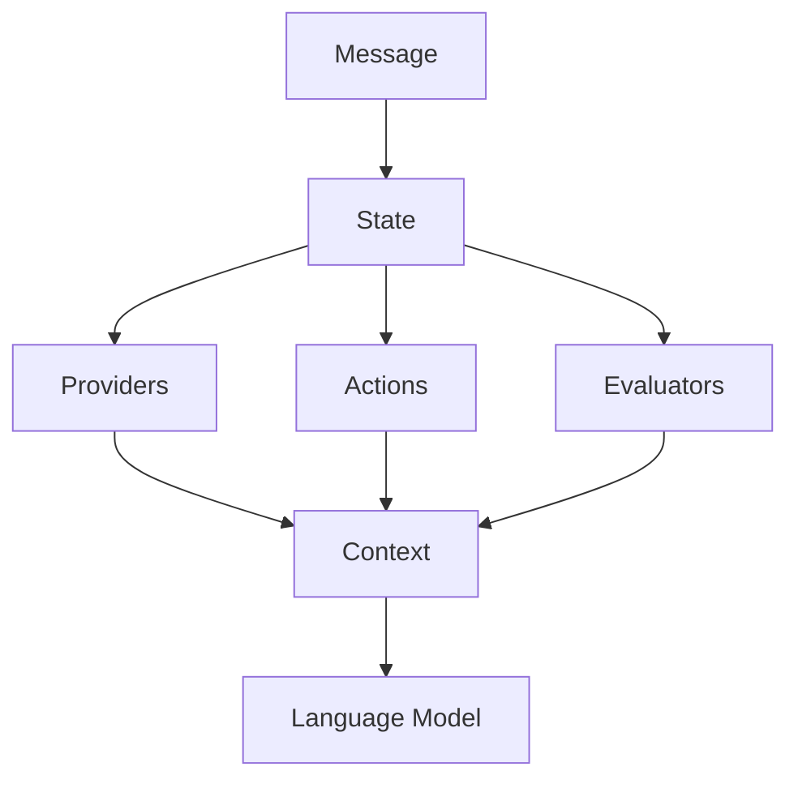

# Context Management in Eliza

## Overview

Context management is a core component of Eliza's architecture, enabling rich, contextual interactions between users and agents. This document explains how context is built, managed, and utilized throughout the system.



## Context Components

### 1. State Object
The [State](cci:1://file:///home/kai/eliza/eliza/packages/core/src/types.ts:1203:0-1224:1) interface forms the foundation of context management:

```typescript
interface State {
    userId?: UUID;
    agentId?: UUID;
    bio: string;
    lore: string;
    messageDirections: string;
    postDirections: string;
    roomId: UUID;
    agentName?: string;
    senderName?: string;
    actors: string;
    actorsData?: Actor[];
    goals?: string;
    goalsData?: Goal[];
    recentMessages: string;
    recentMessagesData: Memory[];
    actionNames?: string;
    actions?: string;
    actionsData?: Action[];
    actionExamples?: string;
    providers?: string;
    responseData?: Content;
    recentInteractionsData?: Memory[];
}
```

### 2. Context Generation
Context is composed through the [composeContext](cci:1://file:///home/kai/eliza/eliza/packages/core/src/context.ts:1:1-1:1) function:

```typescript
composeContext({
    state: State,
    template: string,
    templatingEngine?: 'handlebars'
}): string
```

## Component Responsibilities

### 1. Providers
Providers are responsible for enriching the context with dynamic information:

- **Role**: Bridge between knowledge base and conversation
- **Execution**: Run before action handlers
- **Context Contribution**: Return strings that get concatenated into final context

Example Provider Context Flow:
```typescript
class KnowledgeProvider implements Provider {
    async get(runtime: IAgentRuntime, message: Memory, state?: State) {
        // 1. Generate relevant context
        const context = await this.generateContext(message);
        
        // 2. Format for LLM consumption
        return `
        RELEVANT_KNOWLEDGE:
        ${context}
        `;
    }
}
```

### 2. Actions
Actions consume and potentially modify context:

- **Role**: Process messages with context awareness
- **Execution**: Run after providers
- **Context Usage**: Access full context through state object

Example Action Context Usage:
```typescript
const action: Action = {
    name: "processQuery",
    handler: async (runtime, message, state) => {
        // Access context from state
        const relevantContext = state.providers;
        const userPreferences = state.actorsData;
        
        // Use context to inform processing
        return processWithContext(message, relevantContext);
    }
};
```

### 3. Evaluators
Evaluators validate responses using context:

- **Role**: Ensure responses align with context
- **Execution**: Run after action handlers
- **Context Usage**: Validate response appropriateness

Example Evaluator Context Usage:
```typescript
const evaluator: Evaluator = {
    name: "contextConsistency",
    handler: async (runtime, message, state) => {
        // Check response against context
        const isConsistent = validateAgainstContext(
            message.content,
            state.recentMessages
        );
        
        return {
            pass: isConsistent,
            reason: isConsistent ? "Consistent with context" : "Context violation"
        };
    }
};
```

## Context Flow

1. **State Initialization**
   ```typescript
   const state = await runtime.composeState(message);
   ```

2. **Provider Context**
   ```typescript
   const providerContext = await getProviders(runtime, message, state);
   ```

3. **Action Processing**
   ```typescript
   const result = await action.handler(runtime, message, state);
   ```

4. **Evaluation**
   ```typescript
   const evaluation = await evaluator.handler(runtime, message, state);
   ```

## Best Practices

### 1. Context Formatting

```typescript
// Use clear section headers
return `
SECTION_NAME:
${content}

ANOTHER_SECTION:
${moreContent}
`;
```

### 2. Context Prioritization

```typescript
// Order by importance
const context = [
    criticalInfo,
    userPreferences,
    historicalContext,
    supplementaryInfo
].filter(Boolean).join('\n\n');
```

### 3. Context Validation

```typescript
function validateContext(context: string): boolean {
    // Check required sections
    const hasRequired = [
        'USER_CONTEXT:',
        'RECENT_MESSAGES:',
        'RELEVANT_KNOWLEDGE:'
    ].every(section => context.includes(section));
    
    // Check length
    const withinLimit = context.length <= MAX_CONTEXT_LENGTH;
    
    return hasRequired && withinLimit;
}
```

## Common Patterns

### 1. Dynamic Context Loading

```typescript
async function loadContext(runtime: IAgentRuntime, message: Memory) {
    // Load based on message content
    if (message.content.includes('weather')) {
        return await getWeatherContext();
    }
    if (message.content.includes('schedule')) {
        return await getScheduleContext();
    }
    return getDefaultContext();
}
```

### 2. Context Caching

```typescript
class CachedProvider implements Provider {
    async get(runtime: IAgentRuntime, message: Memory) {
        const cacheKey = `context_${message.id}`;
        
        // Check cache
        const cached = await runtime.cacheManager.get(cacheKey);
        if (cached) return cached;
        
        // Generate and cache
        const context = await generateContext(message);
        await runtime.cacheManager.set(cacheKey, context);
        
        return context;
    }
}
```

### 3. Stateful Context

```typescript
class StatefulProvider implements Provider {
    async get(runtime: IAgentRuntime, message: Memory, state?: State) {
        if (!state) return null;
        
        // Update conversation state
        state.conversationDepth = (state.conversationDepth || 0) + 1;
        
        // Return state-aware context
        return `
        CONVERSATION_STATE:
        Depth: ${state.conversationDepth}
        Topic: ${state.currentTopic || 'None'}
        `;
    }
}
```

## Debugging Context

### 1. Context Inspection

```typescript
function inspectContext(context: string) {
    const sections = context.split('\n\n');
    
    console.log('Context Analysis:', {
        totalLength: context.length,
        sectionCount: sections.length,
        sections: sections.map(s => ({
            name: s.split('\n')[0],
            length: s.length
        }))
    });
}
```

### 2. Context Validation

```typescript
function validateContextStructure(context: string) {
    const required = [
        'USER_CONTEXT:',
        'RECENT_MESSAGES:',
        'RELEVANT_KNOWLEDGE:'
    ];
    
    const missing = required.filter(
        section => !context.includes(section)
    );
    
    if (missing.length) {
        console.warn('Missing required sections:', missing);
        return false;
    }
    
    return true;
}
```

## Conclusion

Effective context management is crucial for creating coherent and contextually aware agent interactions. By understanding how providers, actions, and evaluators work together to build and utilize context, developers can create more sophisticated and natural conversational experiences.

Remember these key points:
1. Providers generate dynamic context
2. Actions consume and modify context
3. Evaluators validate context consistency
4. State object maintains conversation context
5. Clear formatting and structure are essential
6. Cache when possible to improve performance
7. Validate context to ensure quality
