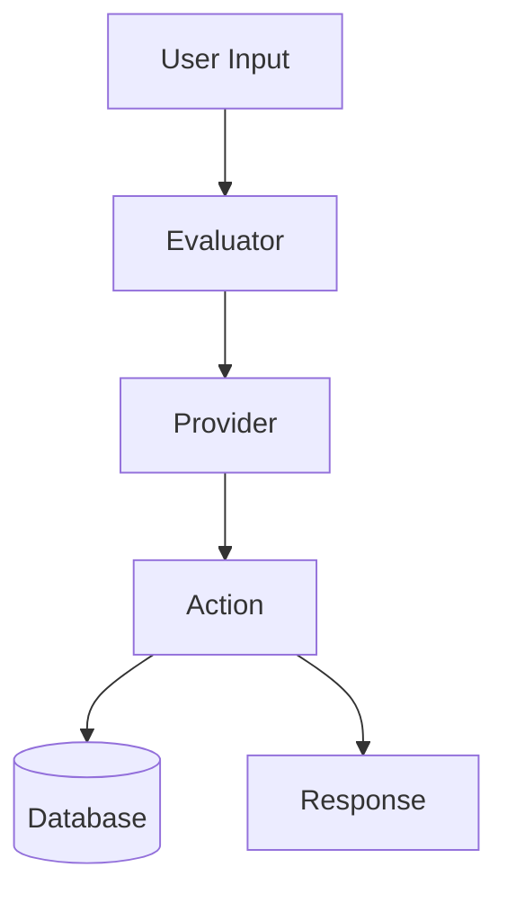
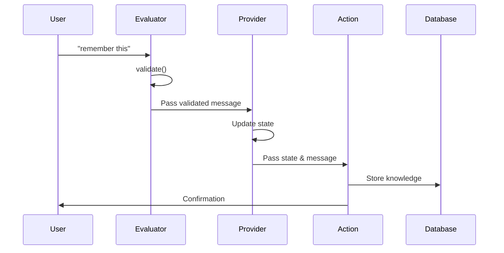
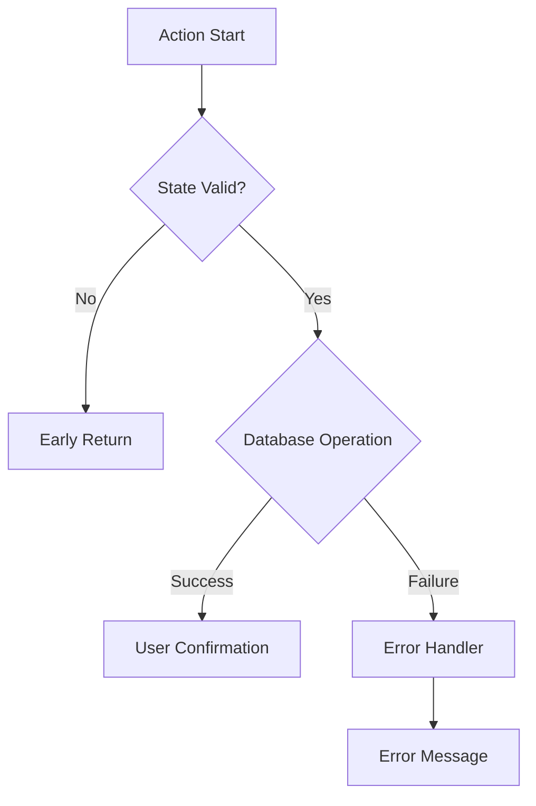

# Database Loader Plugin: Execution Flow Documentation

This document explains the execution flow of the Database Loader Plugin's components: Providers, Evaluators, and Actions. Understanding how these components interact is crucial for maintaining and extending the plugin.

## Component Overview



## Detailed Flow Analysis

### 1. Initial Message Processing

When a user sends a message like "remember this information", the following sequence occurs:



### 2. Component Execution Order

#### 2.1 Evaluator (`saveMemoryEvaluator`)
```typescript
// First component to execute
export const saveMemoryEvaluator: Evaluator = {
    validate: async (runtime, message) => {
        const text = message.content?.text?.toLowerCase() || '';
        return text.includes('save this') || 
               text.includes('remember this');
    }
    // ...
}
```

**Purpose**: 
- Acts as the first filter for messages
- Determines if the message is a save request
- Prevents unnecessary processing of irrelevant messages

**Execution Details**:
1. Receives raw message from user
2. Checks for trigger phrases
3. If validated, allows further processing
4. Logs the validation result

#### 2.2 Provider (`memoryStateProvider`)
```typescript
// Executes after Evaluator validation
export const memoryStateProvider: Provider = {
    get: async (runtime, message, state) => {
        if (text.includes('save this')) {
            return {
                ...state,
                shouldSave: true
            };
        }
        return state;
    }
}
```

**Purpose**:
- Manages state transitions
- Prepares context for Actions
- Controls flow based on state

**Execution Details**:
1. Receives validated message
2. Checks message content
3. Updates state with save flags
4. Preserves existing state data
5. Passes enhanced state to Action

#### 2.3 Action (`saveMemoryAction`)
```typescript
// Final execution component
const saveMemoryAction: Action = {
    handler: async (runtime, message, state, options, callback) => {
        // Only proceed if state indicates save
        if (!state?.shouldSave) return;

        // Process and save
        const previousMessage = // ... get message to save
        await knowledge.set(runtime, {
            id: stringToUuid(previousMessage.content.text),
            content: { text: previousMessage.content.text }
        });
    }
}
```

**Purpose**:
- Performs the actual database operations
- Handles error cases
- Provides user feedback

**Execution Details**:
1. Checks state prerequisites
2. Retrieves relevant messages
3. Constructs KnowledgeItem
4. Performs database operation
5. Sends confirmation
6. Handles any errors

## State Management

### State Flow Example
```typescript
// Initial State
const initialState = {};

// After Provider
const providerState = {
    shouldSave: true
};

// During Action
const actionState = {
    shouldSave: true,
    // Additional runtime data
};
```

### State Transitions
1. **Initial → Provider**:
   - Adds save flags
   - Preserves existing data

2. **Provider → Action**:
   - State determines action execution
   - Controls save behavior

## Error Handling



### Error Cases Handled:
1. Invalid state conditions
2. Missing messages
3. Database operation failures
4. Runtime errors

## Performance Considerations

### Optimization Points
1. **Message Filtering**:
   - Early validation in Evaluator
   - Prevents unnecessary processing

2. **State Management**:
   - Minimal state updates
   - Efficient state passing

3. **Database Operations**:
   - Single database write per save
   - Efficient KnowledgeItem construction

## Best Practices for Extension

### Adding New Features
1. **New Evaluator Rules**:
   ```typescript
   validate: async (runtime, message) => {
       // Add new trigger phrases
       return text.includes('new_trigger');
   }
   ```

2. **State Extensions**:
   ```typescript
   get: async (runtime, message, state) => {
       return {
           ...state,
           newFlag: computeNewFlag(message)
       };
   }
   ```

3. **Action Modifications**:
   ```typescript
   handler: async (runtime, message, state, options, callback) => {
       if (state.newFlag) {
           // Handle new functionality
       }
   }
   ```

## Debugging Tips

### Common Debug Points
1. **Evaluator Validation**:
   - Log message content
   - Check trigger phrase matching

2. **Provider State**:
   - Monitor state transitions
   - Verify flag setting

3. **Action Execution**:
   - Track database operations
   - Monitor error handling

### Logging Strategy
```typescript
elizaLogger.info("Component: Stage", {
    message: message.content,
    state: currentState,
    operation: "description"
});
```

## Integration Testing

### Test Scenarios
1. **Basic Save Flow**:
   ```typescript
   // Test complete flow
   const result = await testFlow([
       { text: "Important info" },
       { text: "save this" }
   ]);
   expect(result.saved).toBeTruthy();
   ```

2. **Error Cases**:
   ```typescript
   // Test error handling
   const result = await testFlow([
       { text: "save this" } // No previous message
   ]);
   expect(result.error).toBeDefined();
   ```

## Conclusion

The execution flow in this plugin demonstrates a well-structured approach to handling user requests for saving information. The separation of concerns between Evaluators, Providers, and Actions creates a maintainable and extensible system.

Key points to remember:
1. Evaluators filter and validate
2. Providers manage state
3. Actions perform operations
4. Error handling occurs at multiple levels
5. State flows through all components

This architecture allows for easy additions of new features while maintaining code clarity and reliability.
