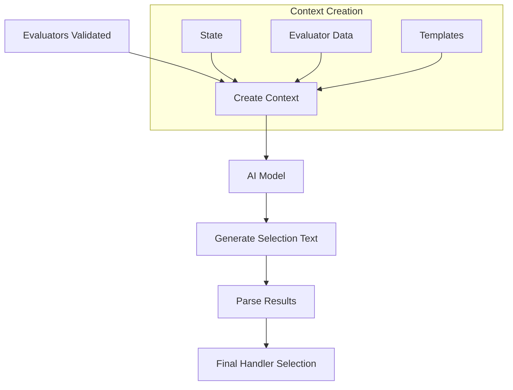
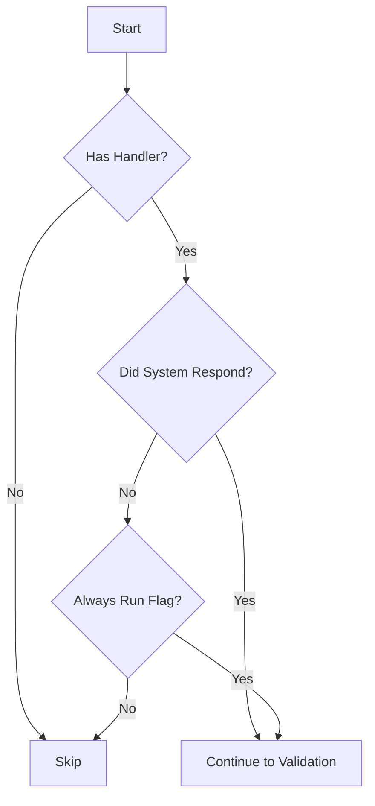

# Handler Runtime Operation - Common Questions

## Text Generation in Handler Selection

### Question: 
"I'm not clear on the 'text generation' checkpoint in the handler selection process. Who generates the text? Where does it come from? How does that step fit in?"

### Answer:
The text generation step is a crucial part of the handler selection process that involves the AI model. Here's a detailed breakdown:

1. **Who Generates the Text?**
   - The text is generated by the AI model (specified as `ModelClass.SMALL` in the code)
   - This is handled by the `generateText()` function in the runtime system

2. **The Process Flow**


3. **How It Works**
```typescript
// 1. Context is composed with validated evaluators
const context = composeContext({
    state: {
        ...state,
        evaluators: formatEvaluators(evaluatorsData),    // List of valid evaluators
        evaluatorNames: formatEvaluatorNames(evaluatorsData),
    },
    template: this.character.templates?.evaluationTemplate || evaluationTemplate,
});

// 2. AI model generates text based on this context
const result = await generateText({
    runtime: this,
    context,
    modelClass: ModelClass.SMALL,
});

// 3. Result is parsed to get final evaluator selection
const evaluators = parseJsonArrayFromText(result) as string[];
```

4. **Why This Step Exists**
   - Provides dynamic selection based on context
   - Allows for intelligent prioritization of handlers
   - Can consider complex relationships between handlers
   - Enables context-aware decision making

## The "didRespond" Checkpoint

### Question:
"I'm not clear about the 'did respond' checkpoint. Does this mean to say it's checking if the handler itself did respond? Or does it mean something else?"

### Answer:
The `didRespond` checkpoint is actually checking if the system has already generated a response to the user's input, not whether the handler itself has responded. Here's the detailed explanation:

1. **What it Actually Checks**
```typescript
if (!evaluator.handler || (!didRespond && !evaluator.alwaysRun)) {
    return null;
}
```

2. **The Logic Flow**


3. **Key Points**
   - `didRespond` is a system-level flag
   - It indicates if the system has generated any response to the current user input
   - It's used to prevent unnecessary handler execution
   - Can be overridden by `alwaysRun` flag

4. **Example Scenarios**
```typescript
// Scenario 1: System has responded, handler will be considered
if (didRespond === true) {
    // Handler will proceed to validation step
}

// Scenario 2: System hasn't responded, but handler must run
if (didRespond === false && evaluator.alwaysRun === true) {
    // Handler will still proceed to validation step
}

// Scenario 3: System hasn't responded, normal handler
if (didRespond === false && evaluator.alwaysRun === false) {
    // Handler will be skipped
}
```

5. **Use Cases**
   - Post-processing handlers (run after response)
   - Cleanup handlers (run regardless of response)
   - State update handlers (may need to run always)
   - Logging handlers (typically always run)

This design allows for:
- Efficient handler execution
- Prevention of unnecessary processing
- Support for required operations via `alwaysRun`
- Clear separation of response-dependent and independent handlers
