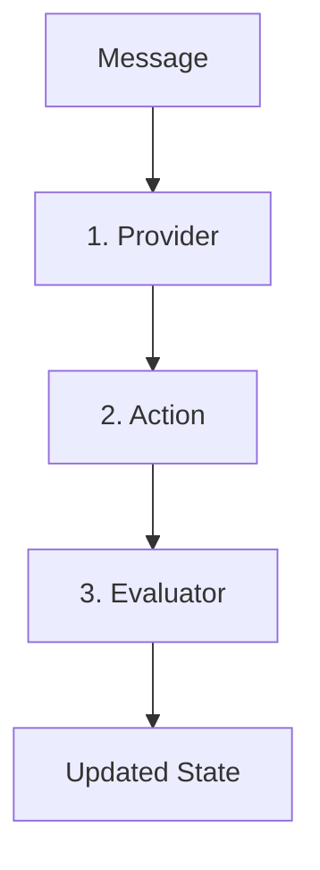
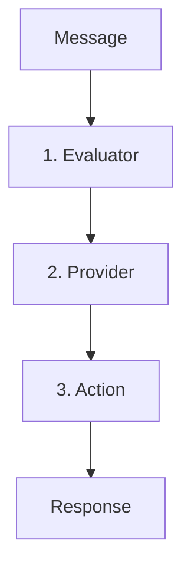

# Database Loader Plugin: Revised Component Flow Overview

## Current Implementation vs. Intended Flow

Our current implementation differs from the intended Eliza framework flow. This document outlines both the current and target states, along with a strategy for alignment.

## Eliza Framework Flow (Target State)



### 1. Provider (First)
- **Purpose**: Context and State Setup
- **Responsibilities**:
  - Gather initial context
  - Check cache/database
  - Prepare state for actions
  - Part of Observe/Orient in OODA loop
- **Key Point**: Should run BEFORE action decisions

### 2. Action (Second)
- **Purpose**: Task Execution
- **Responsibilities**:
  - Use provider-supplied context
  - Execute main functionality
  - Handle database operations
  - Represent Decide/Act in OODA loop
- **Key Point**: Operates with complete context

### 3. Evaluator (Third)
- **Purpose**: Reflection and Learning
- **Responsibilities**:
  - Analyze action outcomes
  - Update agent state
  - Trigger follow-up actions
  - Enable learning/adaptation
- **Key Point**: Post-action analysis

## Current Implementation Analysis

Our current flow:


### Misalignments:
1. **Evaluator Position**:
   - Currently: First in chain
   - Should be: Last in chain
   - Impact: Premature evaluation without action context

2. **Provider Timing**:
   - Currently: After evaluation
   - Should be: First step
   - Impact: Late context injection

3. **Action Context**:
   - Currently: Gets filtered message
   - Should be: Gets full provider context
   - Impact: Incomplete context for decisions

## Architectural Impact

### Current Architecture
```
User Input → Evaluator → Provider → Action → Database
```

**Issues**:
- Evaluator makes decisions without full context
- Provider's state arrives too late
- Action lacks complete context at start

### Target Architecture
```
User Input → Provider → Action → Evaluator → Next Cycle
```

**Benefits**:
- Complete context before decisions
- Proper OODA loop alignment
- True reflection-based learning

## Code Change Strategy Plan

### Phase 1: Component Preparation
1. **Provider Enhancement**
   - Add early context gathering
   - Implement caching mechanisms
   - Prepare for first-position execution

2. **Action Adaptation**
   - Modify to expect rich provider context
   - Update validation logic
   - Enhance error handling

3. **Evaluator Repositioning**
   - Create post-action analysis capabilities
   - Implement state update mechanisms
   - Add learning feedback loops

### Phase 2: Flow Restructuring
1. **Execution Order**
   - Move provider to first position
   - Adjust action triggering
   - Relocate evaluator to end

2. **State Management**
   - Implement state progression
   - Add context preservation
   - Create state validation

3. **Error Handling**
   - Add stage-specific error handling
   - Implement recovery mechanisms
   - Create error state management

### Phase 3: Integration & Testing
1. **Component Integration**
   - Connect restructured components
   - Implement state passing
   - Add monitoring points

2. **Validation**
   - Create flow-specific tests
   - Add state transition tests
   - Implement error scenario tests

## Migration Considerations

### State Management
- Implement gradual state enhancement
- Maintain backward compatibility
- Add state version tracking

### Error Handling
- Add transition-specific error catching
- Implement fallback mechanisms
- Create error recovery paths

### Performance
- Add performance monitoring
- Implement caching strategies
- Create optimization points

## Future Enhancements

### 1. Learning Capabilities
- Add outcome tracking
- Implement pattern recognition
- Create adaptation mechanisms

### 2. Context Enhancement
- Add context persistence
- Implement context merging
- Create context validation

### 3. Flow Optimization
- Add parallel processing
- Implement lazy loading
- Create performance profiling

## Conclusion

The current implementation requires restructuring to align with the Eliza framework's intended flow. The proposed changes will enhance:

1. Context completeness
2. Decision accuracy
3. Learning capabilities
4. Error resilience
5. Performance optimization

This restructuring should be approached gradually, ensuring system stability throughout the transition.
