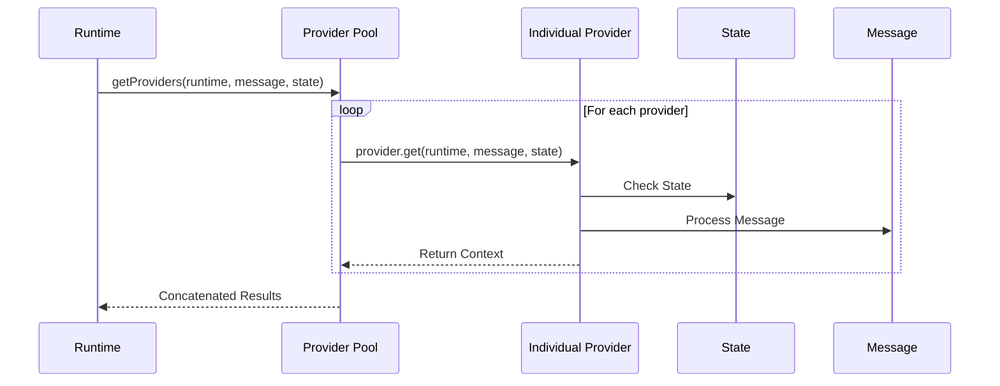
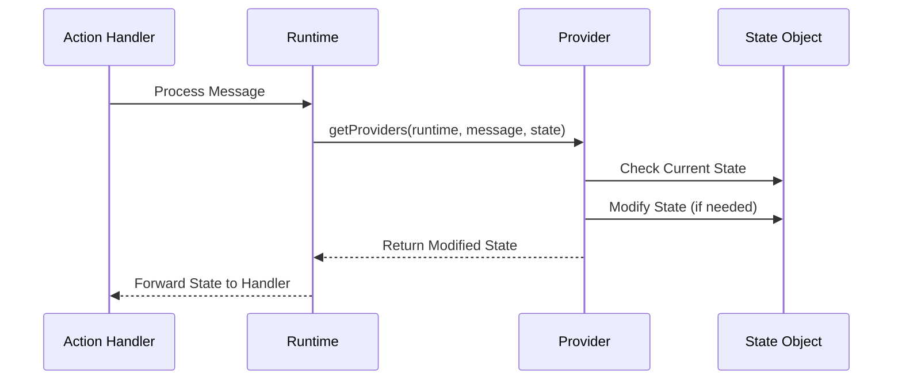

# Provider Runtime Operation

## Overview

Providers are core components in Eliza that inject dynamic context and real-time information into agent interactions. They serve as a bridge between the agent and various external systems, enabling access to data, state management, and contextual information.

## Runtime Architecture



## Provider Lifecycle

### 1. Provider Registration

```typescript
// In plugin definition
const myPlugin: Plugin = {
    name: "my-plugin",
    providers: [myProvider],
    // ...other plugin properties
};
```

### 2. Runtime Integration

```typescript
// Core runtime provider handling
async function getProviders(
    runtime: IAgentRuntime,
    message: Memory,
    state?: State
) {
    const providerResults = await Promise.all(
        runtime.providers.map(async (provider) => {
            return await provider.get(runtime, message, state);
        })
    );
    
    return providerResults
        .filter(result => result != null && result !== "")
        .join("\n");
}
```

### 3. Provider Execution Flow

1. **Initialization**
   - Runtime loads registered providers
   - Each provider is initialized with runtime context

2. **Message Processing**
   - Runtime receives incoming message
   - Current state is gathered
   - Providers are called in parallel

3. **State Management**
   - Provider checks current state
   - Updates state if necessary
   - Returns modified state

4. **Context Generation**
   - Provider processes message and state
   - Generates contextual information
   - Returns formatted context string

## Provider Interface

```typescript
interface Provider {
    get: (
        runtime: IAgentRuntime,
        message: Memory,
        state?: State
    ) => Promise<any>;
}
```

### Key Components

1. **Runtime Access**
   - Full access to runtime services
   - Database operations
   - Message management
   - Cache control

2. **Message Context**
   - Current message details
   - User information
   - Room/conversation context
   - Content analysis

3. **State Management**
   - Current operation state
   - Historical context
   - Operation flags
   - Temporary data storage

## Provider Types

### 1. State Providers
```typescript
const stateProvider: Provider = {
    get: async (runtime, message, state) => {
        // Manage and return operation state
        return {
            ...state,
            operationStatus: "active",
            lastUpdate: Date.now()
        };
    }
};
```

### 2. Data Providers
```typescript
const dataProvider: Provider = {
    get: async (runtime, message, state) => {
        // Fetch and return external data
        const data = await runtime.database.query({
            table: "user_data",
            userId: message.userId
        });
        return formatData(data);
    }
};
```

### 3. Context Providers
```typescript
const contextProvider: Provider = {
    get: async (runtime, message, state) => {
        // Generate contextual information
        const context = await runtime.messageManager.getRecentContext(message);
        return processContext(context);
    }
};
```

## Best Practices

### 1. State Handling
- Always check state before modifications
- Return modified state consistently
- Handle null/undefined states gracefully

### 2. Error Management
```typescript
const robustProvider: Provider = {
    get: async (runtime, message, state) => {
        try {
            // Provider operations
            return result;
        } catch (error) {
            runtime.logger.error("Provider error", error);
            return state; // Return unchanged state on error
        }
    }
};
```

### 3. Performance Optimization
- Use caching when appropriate
- Implement rate limiting
- Handle async operations efficiently
- Filter out empty results

### 4. Context Formation
- Format data consistently
- Provide clear, structured output
- Handle missing data gracefully
- Maintain context relevance

## Runtime Considerations

1. **Parallel Execution**
   - Providers run concurrently
   - Results are aggregated
   - Empty results are filtered
   - Final context is concatenated

2. **State Consistency**
   - State updates are sequential
   - Last provider wins in conflicts
   - State is preserved across calls

3. **Error Handling**
   - Individual provider failures don't block others
   - System continues with available results
   - Errors are logged but not propagated

4. **Resource Management**
   - Providers should be lightweight
   - Heavy operations should be cached
   - Resources should be released properly

## State Management Deep Dive

### State Flow in Runtime



### State Return Behavior

1. **Provider's Return Value**
   ```typescript
   // Provider implementation
   get: async (runtime: IAgentRuntime, message: Memory, state?: State) => {
       // Modifying state directly works because state is an object (passed by reference)
       if (state) {
           state.shouldSave = true;  // This modification persists
           return state;  // Returning state is optional if modified in place
       }
       return null;  // Can return null/undefined for no changes
   }
   ```

2. **Runtime's State Handling**
   ```typescript
   // In core runtime
   async function getProviders(
       runtime: IAgentRuntime,
       message: Memory,
       state?: State
   ) {
       const providerResults = await Promise.all(
           runtime.providers.map(async (provider) => {
               return await provider.get(runtime, message, state);
           })
       );
       
       // Note: Only provider context strings are concatenated
       // State modifications happen in-place
       return providerResults
           .filter(result => result != null && result !== "")
           .join("\n");
   }
   ```

### Key Points About State

1. **State Modification Methods**
   - **Direct Modification**: State is an object passed by reference, so changes made directly to the state object persist
   - **Return Value**: Provider can return the modified state, but this is optional if state was modified in place
   - **Context String**: Provider can return a string to be included in the context, separate from state management

2. **State Persistence**
   ```typescript
   const stateProvider: Provider = {
       get: async (runtime, message, state) => {
           if (state) {
               // Method 1: Direct modification (Recommended)
               state.someFlag = true;  // This persists
               
               // Method 2: Return new state (Not necessary if modified in place)
               return {
                   ...state,
                   someFlag: true
               };
               
               // Method 3: Return context string only
               return "Some context";  // State changes still persist from Method 1
           }
       }
   };
   ```

3. **Common Issues**
   - **Lost State Changes**: If you create a new state object without returning it, changes won't be visible to other components
   - **Undefined State**: Always check if state exists before modifying
   - **Context vs State**: Distinguish between returning context strings and modifying state

4. **Best Practices**
   ```typescript
   const robustStateProvider: Provider = {
       get: async (runtime, message, state) => {
           // 1. Always check state existence
           if (!state) return null;
           
           // 2. Modify state directly for changes
           state.someFlag = true;
           
           // 3. Return context string if needed
           return "Provider context";
           
           // State changes persist without explicit return
       }
   };
   ```

### Action Handler State Access

```typescript
const actionHandler: Handler = async (
    runtime: IAgentRuntime,
    message: Memory,
    state: State,
    options: any,
    callback?: HandlerCallback
) => {
    // State includes all provider modifications
    if (state.shouldSave) {
        // This flag will be available if set by provider
        // No special return handling needed
    }
};
```

### Runtime State Flow

1. **Initialization**
   - Runtime creates initial state object
   - State passed to providers during message processing

2. **Provider Phase**
   - Each provider receives same state object reference
   - Modifications are made directly to state
   - Context strings returned separately

3. **Action Phase**
   - Modified state passed to action handlers
   - All provider changes available in handler
   - State continues to be mutable

4. **State Lifetime**
   - State persists for duration of message processing
   - Cleared/reset for each new message
   - No automatic persistence between messages

This deep dive explains why your `shouldSave` flag modifications in the provider should work as long as:
1. You're modifying the state object directly
2. The state object exists when the modification is made
3. You're checking for the flag in the correct action handler context

If you're not seeing the flag in your action handler, verify:
1. The state object exists when provider runs
2. The modification is happening before the action handler executes
3. You're looking at the same state object instance

## Provider Implementation Template

```typescript
import { Provider, IAgentRuntime, Memory, State } from "@ai16z/eliza";

interface CustomState extends State {
    customData?: any;
}

const customProvider: Provider = {
    get: async (
        runtime: IAgentRuntime,
        message: Memory,
        state?: CustomState
    ) => {
        // 1. Log operation start
        runtime.logger.debug("Custom provider started", {
            messageId: message.id
        });

        try {
            // 2. Check/initialize state
            const currentState = state || {};

            // 3. Process message
            const processedData = await processMessage(message);

            // 4. Update state
            const newState = {
                ...currentState,
                customData: processedData
            };

            // 5. Generate context
            const context = formatContext(processedData);

            // 6. Return result
            return {
                state: newState,
                context: context
            };

        } catch (error) {
            // 7. Handle errors
            runtime.logger.error("Custom provider error", error);
            return state;
        }
    }
};
```

This document outlines the core operation of providers in the Eliza runtime system. Providers are essential for maintaining state, providing context, and integrating external data into the agent's operation flow.
