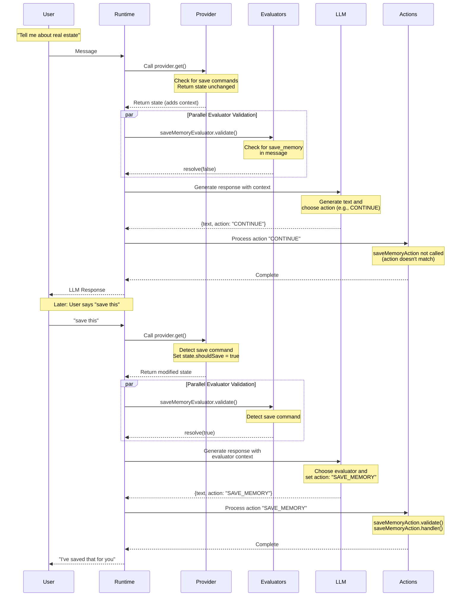
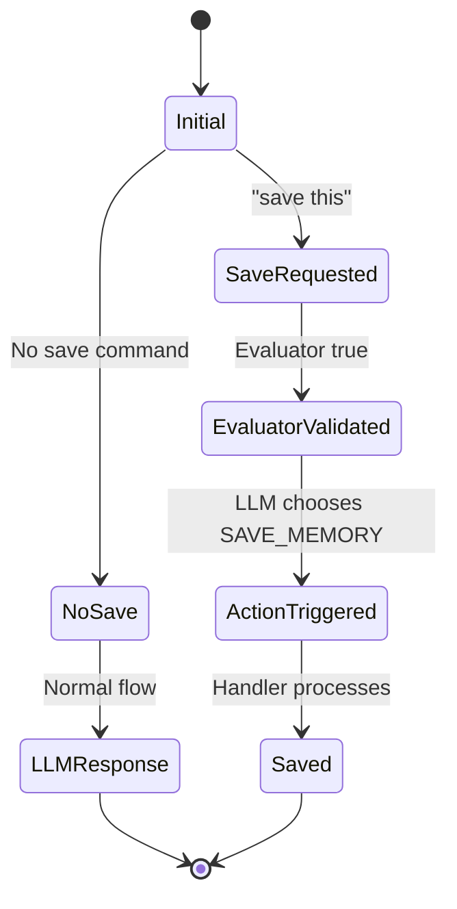

# Save Memory Component Flow

This document illustrates the exact flow of how our save memory components interact with the Eliza runtime.

## Flow Diagram

## Key Points

1. **Initial Flow (Real Estate Question)**
   - Provider checks message → no save command → state unchanged
   - Evaluator validates → false → not included in LLM context
   - LLM generates normal response
   - Action doesn't match our save action → not called

2. **Save Command Flow**
   - Provider detects save command → sets state.shouldSave
   - Evaluator validates → true → included in LLM context
   - LLM sees evaluator context → can choose SAVE_MEMORY action
   - Action matches → handler processes save with state.shouldSave = true

## State Transitions

## Component Responsibilities

1. **Provider**
   - First to see message
   - Sets up state for potential save
   - Adds context for LLM

2. **Evaluator**
   - Validates save intent
   - Adds save context for LLM
   - Influences LLM's action choice

3. **Action**
   - Performs actual save operation
   - Uses state set by provider
   - Only runs if LLM chooses it

4. **LLM**
   - Makes final decision on action
   - Uses context from provider and evaluator
   - Controls action triggering
