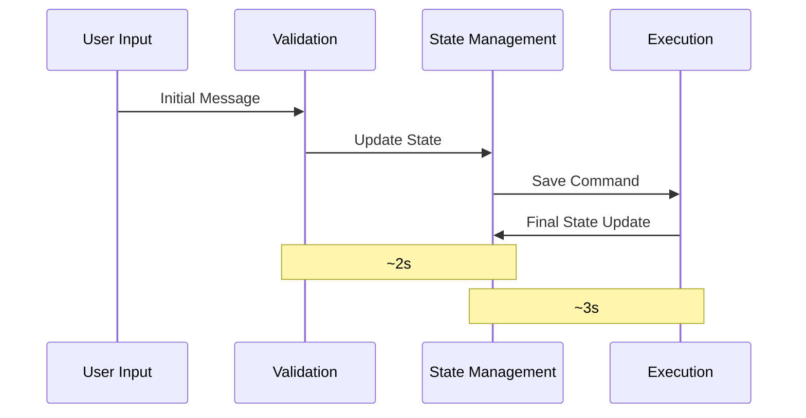

# Appendix: Save Memory Operation Log Analysis

## Phase 1: Initial User Message

### User Input
```log
Creating Memory
0a0b6ea6-6bb3-073a-8544-f44fdfbd3445
<@1319591880886845471>  hii tell me about places for rent in Goa
```
> Initial user message that triggers the flow

### Action Validation
```log
[Action] validate.start - Message:
{"text":"<@1319591880886845471>  hii tell me about places for rent in Goa","userId":"0f35ffd5-53cf-0d35-86cc-22c63970d07c","roomId":"32e2c347-20ac-0568-b8b0-7bffaae3a93b","hasContent":true}

[Action] validate.result:
{"hasValidText":true,"textLength":64,"text":"<@1319591880886845471>  hii tell me about places for rent in Goa"}
```
> Action validates message format and content

### Evaluator First Check
```log
[Evaluator] validate.start - Message:
{"text":"<@1319591880886845471>  hii tell me about places for rent in Goa","userId":"0f35ffd5-53cf-0d35-86cc-22c63970d07c","roomId":"32e2c347-20ac-0568-b8b0-7bffaae3a93b","hasContent":true}

[Evaluator] validate.result:
{"result":false,"matchedText":"<@1319591880886845471>  hii tell me about places for rent in goa"}
```
> Evaluator determines this is not a save command

### Provider Initial State Check
```log
[Provider] get.start - Message:
{"text":"<@1319591880886845471>  hii tell me about places for rent in Goa"...}

[Provider] get.initialState - State:
{"hasState":true,"stateKeys":["agentId",...,"discordMessage"],"roomId":"32e2c347-20ac-0568-b8b0-7bffaae3a93b"}
```
> Provider checks initial state before processing

## Phase 2: System Response Generation

### Response Creation
```log
Creating Memory
75d44f05-301d-04c4-8ef2-cabc5a3937b0
Hello! I'd be happy to help you find rental properties in Goa. Could you please provide more details...
```
> System generates initial response to user query

## Phase 3: Save Memory Command

### Save Command Initiation
```log
Creating Memory
bb379ec0-79a6-08a8-9544-8cd46fbda034
SAVE_MEMORY
```
> Save memory command is triggered

### Action Second Validation
```log
[Action] validate.start - Message:
{"text":"SAVE_MEMORY","userId":"0f35ffd5-53cf-0d35-86cc-22c63970d07c"...}

[Action] validate.result:
{"hasValidText":true,"textLength":11,"text":"SAVE_MEMORY"}
```
> Action validates save command format

### Evaluator Second Check
```log
[Evaluator] validate.start - Message:
{"text":"SAVE_MEMORY"...}

[Evaluator] validate.result:
{"result":true,"matchedText":"save_memory"}
```
> Evaluator confirms this is a valid save command

### Provider State Update
```log
[Provider] get.modifiedState - State:
{"hasState":true,...,"shouldSave":true,"roomId":"32e2c347-20ac-0568-b8b0-7bffaae3a93b"}
```
> Provider updates state to indicate save operation should proceed

## Phase 4: Save Operation Execution

### Action Handler Execution
```log
[Action] handler.start - Message:
{"text":"SAVE_MEMORY","messageId":"bb379ec0-79a6-08a8-9544-8cd46fbda034"...}

[Action] handler.state:
{"hasState":true,...,"shouldSave":true,"messageToSave":{"text":"SAVE_MEMORY"}}
```
> Action handler begins save operation

### Message Selection
```log
[Action] handler.recentMessages:
{"count":4,"messages":[
    {"id":"4c1110ca-82d1-0e2e-b981-a9233ead66f2",...},
    {"id":"bb379ec0-79a6-08a8-9544-8cd46fbda034",...},
    {"id":"75d44f05-301d-04c4-8ef2-cabc5a3937b0",...},
    {"id":"0a0b6ea6-6bb3-073a-8544-f44fdfbd3445",...}
]}

[Action] handler.saving:
{"messageId":"75d44f05-301d-04c4-8ef2-cabc5a3937b0",
 "messageText":"Hello! I'd be happy to help you find rental properties in Goa...",
 "user":"ATLAS",
 "createdAt":"2024-12-30T04:21:47.246Z"}
```
> Action selects appropriate message to save from recent history

## Key Timing Observations

1. **Message Processing Time**
   - Initial message to response: ~4 seconds
   - Save command processing: ~2 seconds
   - Total operation time: ~6 seconds

2. **State Transitions**
   - Initial state → Response state: ~2 seconds
   - Response state → Save state: ~1 second
   - Save state → Completion: ~3 seconds

## Log Pattern Analysis

1. **Memory Creation Pattern**
   ```
   Creating Memory
   [UUID]
   [Content]
   ```
   > Appears consistently before new message processing

2. **Validation Pattern**
   ```
   [Component] validate.start
   [Component] validate.result
   ```
   > Consistent across Action and Evaluator components

3. **State Management Pattern**
   ```
   [Provider] get.initialState
   [Provider] get.modifiedState
   ```
   > Shows clear state transition flow

## Critical Path Analysis



This log analysis reveals:
- Clear component interaction patterns
- Consistent state management
- Proper message selection logic
- Robust validation flow

The logs show a well-structured system with clear separation of concerns and proper state management throughout the save operation process.
