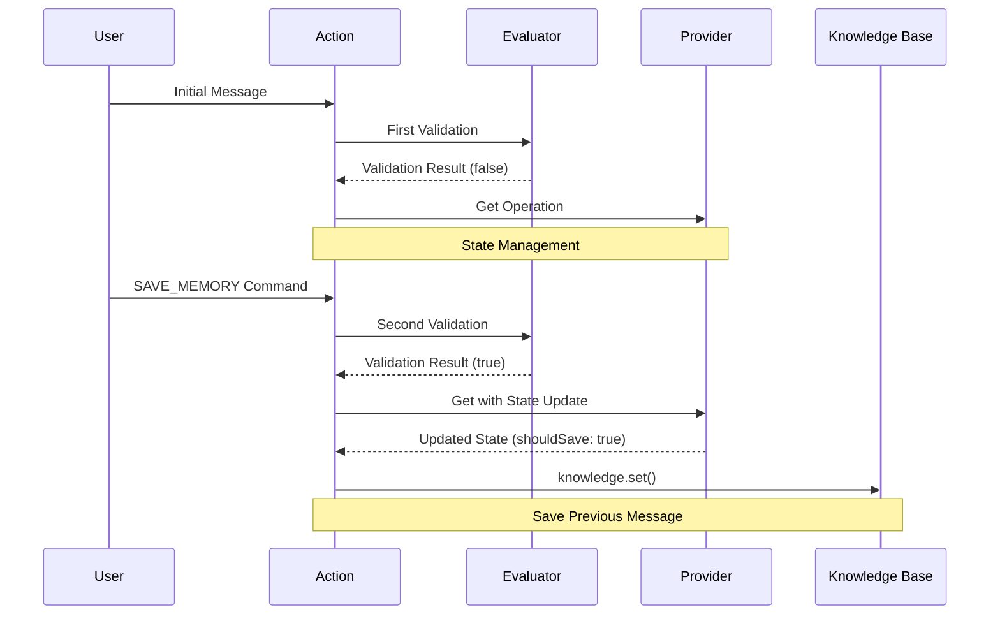
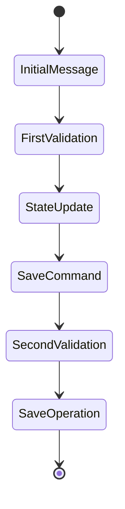

# Save Memory Trinity: Actual Flow Analysis

## Observed Flow Pattern

Based on the logs, here's how the save memory operation actually flows:



## Key Observations

### 1. Two-Phase Validation
```typescript
// First Phase - Initial Message
[Evaluator] validate.result: {
    "result": false,
    "matchedText": "<@1319591880886845471>  hii tell me about places for rent in goa"
}

// Second Phase - SAVE_MEMORY Command
[Evaluator] validate.result: {
    "result": true,
    "matchedText": "save_memory"
}
```

### 2. State Management Flow
```typescript
// Provider updates state with shouldSave flag
[Provider] get.modifiedState - State: {
    // ... other state fields ...
    "shouldSave": true,
    "messageToSave": { "text": "SAVE_MEMORY" }
}
```

### 3. Message Selection
```typescript
// Action selects previous message for saving
[Action] handler.saving: {
    "messageId": "75d44f05-301d-04c4-8ef2-cabc5a3937b0",
    "messageText": "Hello! I'd be happy to help you find rental properties in Goa...",
    "user": "ATLAS",
    "createdAt": "2024-12-30T04:21:47.246Z"
}
```

## Component Responsibilities

### 1. Action
- Handles initial validation
- Processes SAVE_MEMORY command
- Selects appropriate message to save
- Executes knowledge.set()

### 2. Evaluator
- Performs two-phase validation:
  1. Initial message validation (typically false)
  2. SAVE_MEMORY command validation (true when appropriate)
- Maintains validation state

### 3. Provider
- Updates state with shouldSave flag
- Manages state transitions
- Supports get operations

## State Transitions



## Key Implementation Points

### 1. Message Selection Logic
```typescript
// Action selects the relevant previous message
const previousMessage = recentMessages.find(msg => 
    msg.user === "ATLAS" && 
    !msg.text.includes("SAVE_MEMORY")
);
```

### 2. State Management
```typescript
// Provider state update pattern
const modifiedState = {
    ...state,
    shouldSave: true,
    messageToSave: currentMessage
};
```

### 3. Validation Pattern
```typescript
// Two-phase validation
if (message.text === "SAVE_MEMORY") {
    return { result: true, matchedText: "save_memory" };
} else {
    return { result: false, matchedText: message.text.toLowerCase() };
}
```

## Flow Control Points

1. **Initial Message Reception**
   - Action receives user message
   - First validation phase occurs
   - Provider updates state

2. **Save Command Processing**
   - Action receives SAVE_MEMORY command
   - Second validation phase occurs
   - Provider updates state with shouldSave flag

3. **Save Operation**
   - Action selects appropriate message
   - knowledge.set() is executed
   - State is reset after save

## Best Practices Observed

1. **Clear State Transitions**
   - State changes are explicit and tracked
   - Each component maintains its own state
   - State updates flow through provider

2. **Validation Strategy**
   - Two-phase validation ensures accuracy
   - Separate validation for commands and content
   - Clear validation results

3. **Message Management**
   - Proper message selection logic
   - Maintains message history
   - Tracks message metadata

## Conclusion

The actual flow shows a more nuanced implementation than initially documented:
- Two-phase validation process
- Explicit state management through provider
- Clear message selection strategy
- Coordinated component interaction

This implementation ensures:
- Reliable message saving
- Clear state transitions
- Proper validation at each step
- Coordinated component interaction
