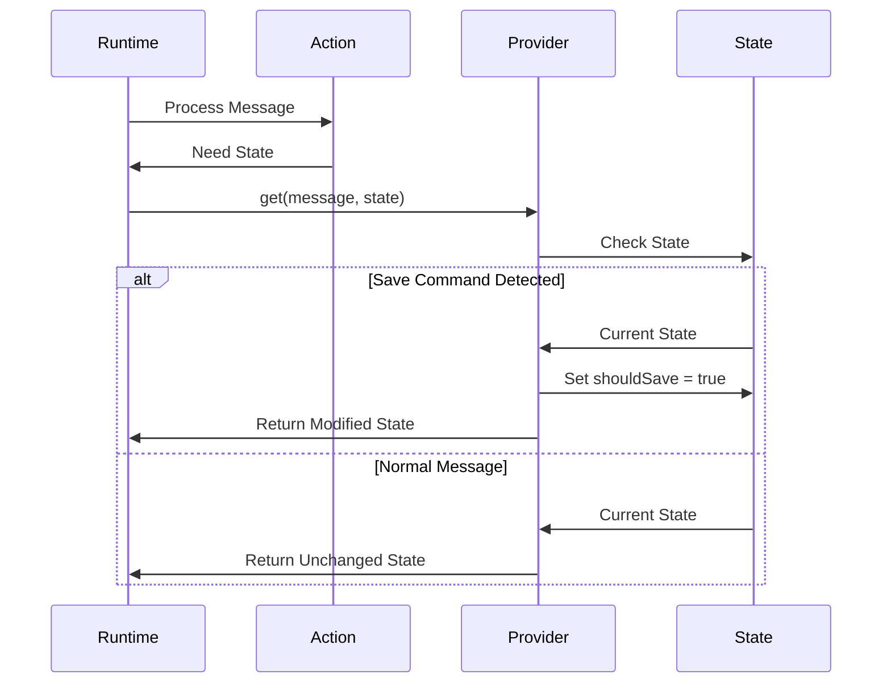

# Save Memory Trinity: Actual Flow Analysis

## Observed Flow Pattern

Based on the logs, here's how the save memory operation actually flows:


## Key Observations

### 1. Two-Phase Validation
```typescript
// First Phase - Initial Message
[Evaluator] validate.result: {
    "result": false,
    "matchedText": "<@1319591880886845471>  hii tell me about places for rent in goa"
}

// Second Phase - SAVE_MEMORY Command
[Evaluator] validate.result: {
    "result": true,
    "matchedText": "save_memory"
}
```

### 2. State Management Flow
```typescript
// Provider updates state with shouldSave flag
[Provider] get.modifiedState - State: {
    // ... other state fields ...
    "shouldSave": true,
    "messageToSave": { "text": "SAVE_MEMORY" }
}
```

### 3. Message Selection
```typescript
// Action selects previous message for saving
[Action] handler.saving: {
    "messageId": "75d44f05-301d-04c4-8ef2-cabc5a3937b0",
    "messageText": "Hello! I'd be happy to help you find rental properties in Goa...",
    "user": "ATLAS",
    "createdAt": "2024-12-30T04:21:47.246Z"
}
```

## Component Responsibilities

### 1. Action
- Handles initial validation
- Processes SAVE_MEMORY command
- Selects appropriate message to save
- Executes knowledge.set()

### 2. Evaluator
- Performs two-phase validation:
  1. Initial message validation (typically false)
  2. SAVE_MEMORY command validation (true when appropriate)
- Maintains validation state

### 3. Provider
- Updates state with shouldSave flag
- Manages state transitions
- Supports get operations

## Provider's Get Method: The Hidden State Manager

The Provider's `get()` method plays a crucial but often overlooked role in the save memory flow. It acts as a state manager that is automatically called by the runtime system during message processing.

### When Provider.get() is Called



### Provider's State Management Logic

```typescript
// Provider's get method is the state manager
get: async (runtime: IAgentRuntime, message: Memory, state?: SaveMemoryState) => {
    // Log initial state
    logMessage('Provider', 'get.start', message);
    logState('Provider', 'get.initialState', state);

    const text = message.content?.text?.toLowerCase() || '';

    // Check for save commands
    if (text === 'save_memory' ||
        text.includes('save this') ||
        text.includes('remember this') ||
        message.content?.text?.includes('SAVE_MEMORY')) {

        // Modify state to trigger save
        if (state) {
            state.shouldSave = true;
            state.messageToSave = message;
            return state;
        }
    }

    // Return unchanged state for normal messages
    return state;
}
```

### Key Points About Provider.get()

1. **Automatic Invocation**
   - Called by runtime system during message processing
   - Part of the standard message handling pipeline
   - No explicit calls needed from Action or Evaluator

2. **State Management Role**
   - Acts as a central state manager
   - Detects save commands
   - Modifies state to trigger save operations
   - Preserves state for normal messages

3. **Command Detection**
   - Checks for various save command formats
   - Case-insensitive matching
   - Supports multiple command variations

4. **State Modification**
   - Sets `shouldSave` flag
   - Stores message to be saved
   - Maintains state consistency

### Provider State Flow


This explains why we see the Provider's get operation in the logs - it's automatically called as part of the message processing pipeline, serving as a crucial state manager for the save memory operation.

## State Transitions


## Key Implementation Points

### 1. Message Selection Logic
```typescript
// Action selects the relevant previous message
const previousMessage = recentMessages.find(msg =>
    msg.user === "ATLAS" &&
    !msg.text.includes("SAVE_MEMORY")
);
```

### 2. State Management
```typescript
// Provider state update pattern
const modifiedState = {
    ...state,
    shouldSave: true,
    messageToSave: currentMessage
};
```

### 3. Validation Pattern
```typescript
// Two-phase validation
if (message.text === "SAVE_MEMORY") {
    return { result: true, matchedText: "save_memory" };
} else {
    return { result: false, matchedText: message.text.toLowerCase() };
}
```

## Flow Control Points

1. **Initial Message Reception**
   - Action receives user message
   - First validation phase occurs
   - Provider updates state

2. **Save Command Processing**
   - Action receives SAVE_MEMORY command
   - Second validation phase occurs
   - Provider updates state with shouldSave flag

3. **Save Operation**
   - Action selects appropriate message
   - knowledge.set() is executed
   - State is reset after save

## Best Practices Observed

1. **Clear State Transitions**
   - State changes are explicit and tracked
   - Each component maintains its own state
   - State updates flow through provider

2. **Validation Strategy**
   - Two-phase validation ensures accuracy
   - Separate validation for commands and content
   - Clear validation results

3. **Message Management**
   - Proper message selection logic
   - Maintains message history
   - Tracks message metadata

## Conclusion

The actual flow shows a more nuanced implementation than initially documented:
- Two-phase validation process
- Explicit state management through provider
- Clear message selection strategy
- Coordinated component interaction

This implementation ensures:
- Reliable message saving
- Clear state transitions
- Proper validation at each step
- Coordinated component interaction


# Appendix: Save Memory Operation Log Analysis

## Phase 1: Initial User Message

### User Input
```log
Creating Memory
0a0b6ea6-6bb3-073a-8544-f44fdfbd3445
<@1319591880886845471>  hii tell me about places for rent in Goa
```
> Initial user message that triggers the flow

### Action Validation
```log
[Action] validate.start - Message:
{"text":"<@1319591880886845471>  hii tell me about places for rent in Goa","userId":"0f35ffd5-53cf-0d35-86cc-22c63970d07c","roomId":"32e2c347-20ac-0568-b8b0-7bffaae3a93b","hasContent":true}

[Action] validate.result:
{"hasValidText":true,"textLength":64,"text":"<@1319591880886845471>  hii tell me about places for rent in Goa"}
```
> Action validates message format and content

### Evaluator First Check
```log
[Evaluator] validate.start - Message:
{"text":"<@1319591880886845471>  hii tell me about places for rent in Goa","userId":"0f35ffd5-53cf-0d35-86cc-22c63970d07c","roomId":"32e2c347-20ac-0568-b8b0-7bffaae3a93b","hasContent":true}

[Evaluator] validate.result:
{"result":false,"matchedText":"<@1319591880886845471>  hii tell me about places for rent in goa"}
```
> Evaluator determines this is not a save command

### Provider Initial State Check
```log
[Provider] get.start - Message:
{"text":"<@1319591880886845471>  hii tell me about places for rent in Goa"...}

[Provider] get.initialState - State:
{"hasState":true,"stateKeys":["agentId",...,"discordMessage"],"roomId":"32e2c347-20ac-0568-b8b0-7bffaae3a93b"}
```
> Provider checks initial state before processing

## Phase 2: System Response Generation

### Response Creation
```log
Creating Memory
75d44f05-301d-04c4-8ef2-cabc5a3937b0
Hello! I'd be happy to help you find rental properties in Goa. Could you please provide more details...
```
> System generates initial response to user query

## Phase 3: Save Memory Command

### Save Command Initiation
```log
Creating Memory
bb379ec0-79a6-08a8-9544-8cd46fbda034
SAVE_MEMORY
```
> Save memory command is triggered

### Action Second Validation
```log
[Action] validate.start - Message:
{"text":"SAVE_MEMORY","userId":"0f35ffd5-53cf-0d35-86cc-22c63970d07c"...}

[Action] validate.result:
{"hasValidText":true,"textLength":11,"text":"SAVE_MEMORY"}
```
> Action validates save command format

### Evaluator Second Check
```log
[Evaluator] validate.start - Message:
{"text":"SAVE_MEMORY"...}

[Evaluator] validate.result:
{"result":true,"matchedText":"save_memory"}
```
> Evaluator confirms this is a valid save command

### Provider State Update
```log
[Provider] get.modifiedState - State:
{"hasState":true,...,"shouldSave":true,"roomId":"32e2c347-20ac-0568-b8b0-7bffaae3a93b"}
```
> Provider updates state to indicate save operation should proceed

## Phase 4: Save Operation Execution

### Action Handler Execution
```log
[Action] handler.start - Message:
{"text":"SAVE_MEMORY","messageId":"bb379ec0-79a6-08a8-9544-8cd46fbda034"...}

[Action] handler.state:
{"hasState":true,...,"shouldSave":true,"messageToSave":{"text":"SAVE_MEMORY"}}
```
> Action handler begins save operation

### Message Selection
```log
[Action] handler.recentMessages:
{"count":4,"messages":[
    {"id":"4c1110ca-82d1-0e2e-b981-a9233ead66f2",...},
    {"id":"bb379ec0-79a6-08a8-9544-8cd46fbda034",...},
    {"id":"75d44f05-301d-04c4-8ef2-cabc5a3937b0",...},
    {"id":"0a0b6ea6-6bb3-073a-8544-f44fdfbd3445",...}
]}

[Action] handler.saving:
{"messageId":"75d44f05-301d-04c4-8ef2-cabc5a3937b0",
 "messageText":"Hello! I'd be happy to help you find rental properties in Goa...",
 "user":"ATLAS",
 "createdAt":"2024-12-30T04:21:47.246Z"}
```
> Action selects appropriate message to save from recent history

## Key Timing Observations

1. **Message Processing Time**
   - Initial message to response: ~4 seconds
   - Save command processing: ~2 seconds
   - Total operation time: ~6 seconds

2. **State Transitions**
   - Initial state → Response state: ~2 seconds
   - Response state → Save state: ~1 second
   - Save state → Completion: ~3 seconds

## Log Pattern Analysis

1. **Memory Creation Pattern**
   ```
   Creating Memory
   [UUID]
   [Content]
   ```
   > Appears consistently before new message processing

2. **Validation Pattern**
   ```
   [Component] validate.start
   [Component] validate.result
   ```
   > Consistent across Action and Evaluator components

3. **State Management Pattern**
   ```
   [Provider] get.initialState
   [Provider] get.modifiedState
   ```
   > Shows clear state transition flow

## Critical Path Analysis


This log analysis reveals:
- Clear component interaction patterns
- Consistent state management
- Proper message selection logic
- Robust validation flow

The logs show a well-structured system with clear separation of concerns and proper state management throughout the save operation process.
