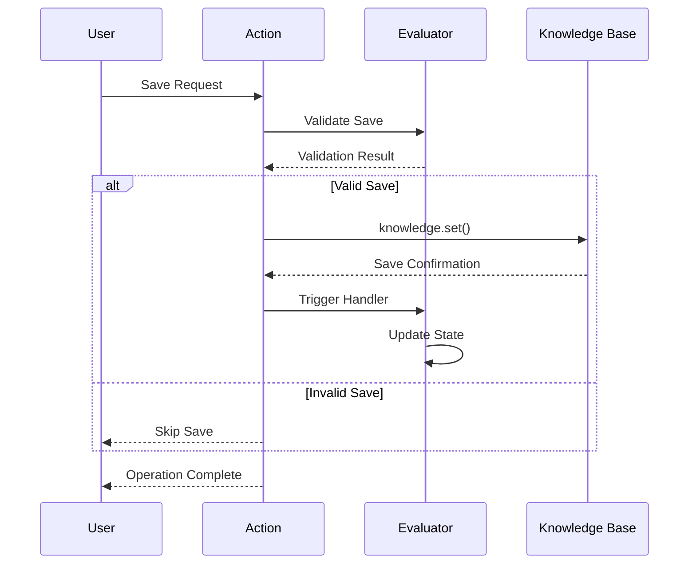

# The Save Memory Trinity: Action, Provider, and Evaluator (Revised)

## Overview

The Save Memory feature implements a trinity pattern with a specific implementation detail: the Action handles the actual storage operation through `knowledge.set()`, while the Provider and Evaluator play supporting roles in the process.

```mermaid
graph TD
    subgraph Trinity Pattern
        A[Action<br>knowledge.set()] -->|Validates through| E[Evaluator]
        E -->|Provides Validation| A
        P[Provider] -->|Supports| A
        E -->|Informs| P
    end
```

## Component Roles

### 1. The Action (SAVE_MEMORY)
The Action is both the orchestrator and the executor of the save operation.

```typescript
// Action Definition with Storage Responsibility
export const SAVE_MEMORY: Action = {
    name: 'SAVE_MEMORY',
    handler: async (runtime, message, state, options, callback) => {
        // Actual storage operation happens here
        const memoryToSave = {
            id: stringToUuid(message.content.text),
            content: {
                text: message.content.text
            }
        };
        await knowledge.set(runtime as AgentRuntime, memoryToSave);
    }
};
```

**Responsibilities:**
- Initiates the save memory operation
- Executes the actual storage operation via `knowledge.set()`
- Manages operation state
- Handles callbacks and responses

### 2. The Provider (DatabaseProvider)
The Provider serves as a support component for memory operations.

```typescript
export class DatabaseProvider implements Provider {
    // Provider supports but doesn't execute storage
    async get(runtime: IAgentRuntime, message: Memory, state?: State) {
        // Retrieval operations
    }
}
```

**Responsibilities:**
- Supports retrieval operations
- Maintains database connections
- Provides infrastructure support

### 3. The Evaluator (SaveMemoryEvaluator)
The Evaluator determines if a memory should be saved.

```typescript
export const SaveMemoryEvaluator: Evaluator = {
    name: 'save_memory',
    validate: async (runtime, message, state) => {
        // Validation logic
        return shouldSaveMemory(message, state);
    },
    handler: async (runtime, message, state) => {
        // Post-save operations
        await updateStateAfterSave(state);
    }
};
```

**Responsibilities:**
- Validates save operations
- Determines save conditions
- Handles post-save operations
- Maintains save criteria

## Interaction Flow



## State Management

The state flows primarily through the Action:

```typescript
interface SaveMemoryState {
    shouldSave: boolean;
    messageToSave?: Memory;
}

// Action handles state transitions
async handler(runtime, message, state: SaveMemoryState) {
    if (state.shouldSave) {
        await knowledge.set(runtime, state.messageToSave);
        return {
            ...state,
            shouldSave: false // Reset after save
        };
    }
}
```

## Key Implementation Details

### 1. Storage Operation in Action
```typescript
// In Action handler
const memoryToSave = {
    id: stringToUuid(previousMessage.content.text),
    content: {
        text: previousMessage.content.text
    }
};
await knowledge.set(runtime as AgentRuntime, memoryToSave);
```

### 2. Validation Flow
```typescript
// Evaluator validation
async validate(runtime: IAgentRuntime, message: Memory) {
    // Check conditions
    return {
        shouldSave: true,
        messageToSave: message
    };
}
```

### 3. State Transitions
```typescript
// Action state management
if (!state?.shouldSave) {
    return {
        shouldSave: false
    };
}
```

## Best Practices

1. **Clear Responsibility Assignment**
   - Action: Handles storage and orchestration
   - Provider: Supports infrastructure
   - Evaluator: Manages validation logic

2. **State Management**
   ```typescript
   // State flows through action
   interface ActionState {
       shouldSave: boolean;
       messageToSave?: Memory;
   }
   ```

3. **Error Handling**
   ```typescript
   try {
       await knowledge.set(runtime, memoryToSave);
   } catch (error) {
       // Action handles storage errors
       elizaLogger.error('[Action] Storage error:', error);
   }
   ```

## Testing Strategy

```typescript
describe('Save Memory Trinity', () => {
    test('action saves memory directly', async () => {
        const action = new SaveMemoryAction();
        const result = await action.handler(runtime, message, {
            shouldSave: true,
            messageToSave: testMemory
        });
        
        // Verify storage operation
        expect(knowledge.get(testMemory.id)).toBeDefined();
    });
});
```

## Conclusion

The Save Memory Trinity implementation has these key characteristics:
- Action-centric storage operation
- Clear separation of validation (Evaluator) and support (Provider) concerns
- Direct state management through the Action
- Streamlined data flow with `knowledge.set()`

Understanding this implementation is crucial for:
- Debugging save operations
- Extending functionality
- Maintaining code quality
- Ensuring system reliability
