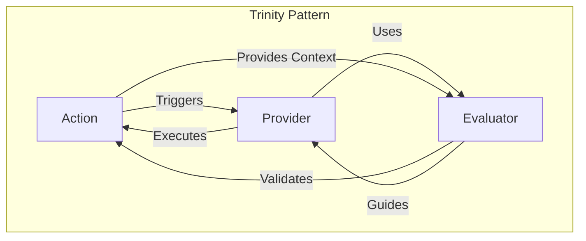
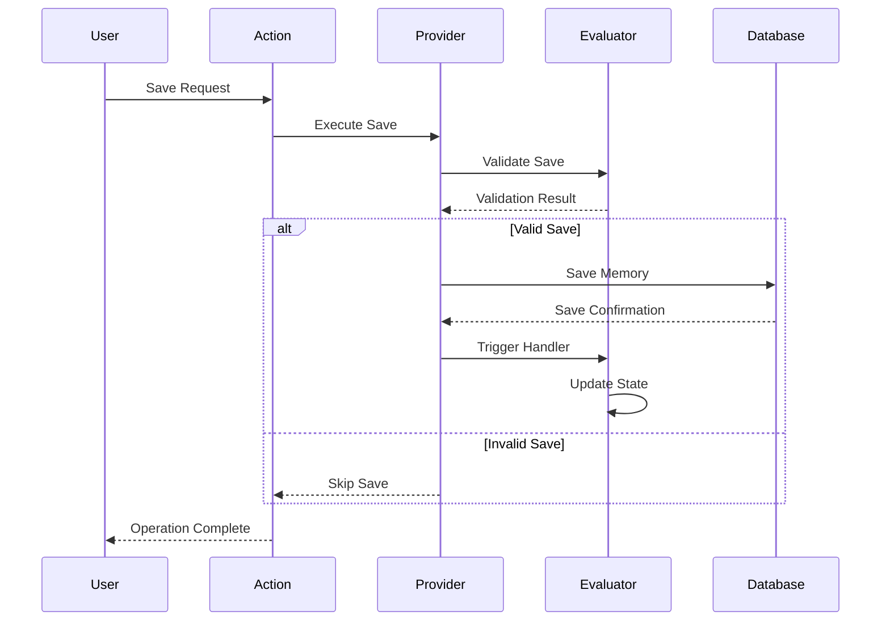

# The Save Memory Trinity: Action, Provider, and Evaluator

## Overview

The Save Memory feature is built on three interconnected components that work together in a trinity pattern: the Action, the Provider, and the Evaluator. Each has a specific role and responsibility, creating a robust and flexible system for memory management.



## Component Roles

### 1. The Action (SAVE_MEMORY)
The Action represents the user's intent to save a memory. It is the entry point and orchestrator.

```typescript
// Action Definition
export const SAVE_MEMORY: Action = {
    name: 'SAVE_MEMORY',
    execute: async (runtime, message, state) => {
        // Delegates to provider for actual execution
        return runtime.provider.saveMemory(message, state);
    }
};
```

**Responsibilities:**
- Initiates the save memory operation
- Provides the interface for the runtime system
- Delegates actual execution to the provider
- Maintains operation context

### 2. The Provider (DatabaseProvider)
The Provider is the implementation layer that knows how to actually save memories.

```typescript
export class DatabaseProvider implements Provider {
    async saveMemory(message: Memory, state: State): Promise<void> {
        // Validates through evaluator
        const canSave = await this.evaluator.validate(message, state);
        
        if (canSave) {
            // Actual database operations
            await this.storage.save(message);
        }
    }
}
```

**Responsibilities:**
- Implements the actual save operation
- Manages database connections
- Handles storage logic
- Coordinates with evaluator for validation

### 3. The Evaluator (SaveMemoryEvaluator)
The Evaluator determines if and how a memory should be saved.

```typescript
export const SaveMemoryEvaluator: Evaluator = {
    name: 'save_memory',
    validate: async (runtime, message, state) => {
        // Validation logic
        return shouldSaveMemory(message, state);
    },
    handler: async (runtime, message, state) => {
        // Post-save operations
        await updateStateAfterSave(state);
    }
};
```

**Responsibilities:**
- Validates save operations
- Determines save conditions
- Handles post-save operations
- Maintains save criteria

## Interaction Flow



## State Management

The trinity pattern maintains state across components:

```typescript
interface SaveMemoryState {
    // Action State
    saveIntent: boolean;
    saveContext: SaveContext;
    
    // Provider State
    lastSaved: string;
    saveCount: number;
    
    // Evaluator State
    validationHistory: ValidationRecord[];
    saveConditions: SaveCondition[];
}
```

## Communication Patterns

### 1. Action → Provider
```typescript
// Action initiates provider operations
async execute(runtime, message, state) {
    const provider = runtime.getProvider();
    await provider.saveMemory(message, state);
}
```

### 2. Provider → Evaluator
```typescript
// Provider checks with evaluator
async saveMemory(message, state) {
    const evaluator = this.getEvaluator();
    const canProceed = await evaluator.validate(message, state);
}
```

### 3. Evaluator → Action
```typescript
// Evaluator provides feedback to action
async validate(runtime, message, state) {
    const actionContext = state.currentAction;
    return this.validateWithContext(message, actionContext);
}
```

## Error Handling

The trinity pattern includes coordinated error handling:

```typescript
class SaveMemoryError extends Error {
    constructor(
        public component: 'action' | 'provider' | 'evaluator',
        public stage: 'validation' | 'execution' | 'handling',
        message: string
    ) {
        super(`[${component}:${stage}] ${message}`);
    }
}
```

## Best Practices

1. **Clear Separation of Concerns**
   - Action: User intent and orchestration
   - Provider: Implementation and storage
   - Evaluator: Validation and rules

2. **State Isolation**
   ```typescript
   // Each component manages its own state
   interface ActionState { /* ... */ }
   interface ProviderState { /* ... */ }
   interface EvaluatorState { /* ... */ }
   ```

3. **Consistent Communication**
   ```typescript
   // Use typed messages between components
   interface ComponentMessage<T> {
       source: ComponentType;
       target: ComponentType;
       payload: T;
   }
   ```

## Testing Strategy

```typescript
describe('Save Memory Trinity', () => {
    let action: Action;
    let provider: Provider;
    let evaluator: Evaluator;

    beforeEach(() => {
        // Initialize trinity components
        action = new SaveMemoryAction();
        provider = new DatabaseProvider();
        evaluator = new SaveMemoryEvaluator();
    });

    test('complete save flow', async () => {
        // Test full interaction between components
        const result = await action.execute(runtime, message, state);
        expect(result.saved).toBe(true);
        expect(provider.getLastSave()).toBeDefined();
        expect(evaluator.getValidationCount()).toBe(1);
    });
});
```

## Debugging Tips

1. **Component Logging**
   ```typescript
   class TrinityLogger {
       logAction(action: string, context: any) { /* ... */ }
       logProvider(operation: string, details: any) { /* ... */ }
       logEvaluator(decision: string, criteria: any) { /* ... */ }
   }
   ```

2. **State Tracking**
   ```typescript
   class TrinityStateTracker {
       trackStateChange(
           component: ComponentType,
           before: State,
           after: State
       ) { /* ... */ }
   }
   ```

## Conclusion

The Save Memory Trinity pattern provides:
- Clear separation of concerns
- Robust error handling
- Flexible state management
- Testable components
- Maintainable codebase

Understanding this relationship is crucial for:
- Debugging save operations
- Extending functionality
- Maintaining code quality
- Ensuring system reliability
