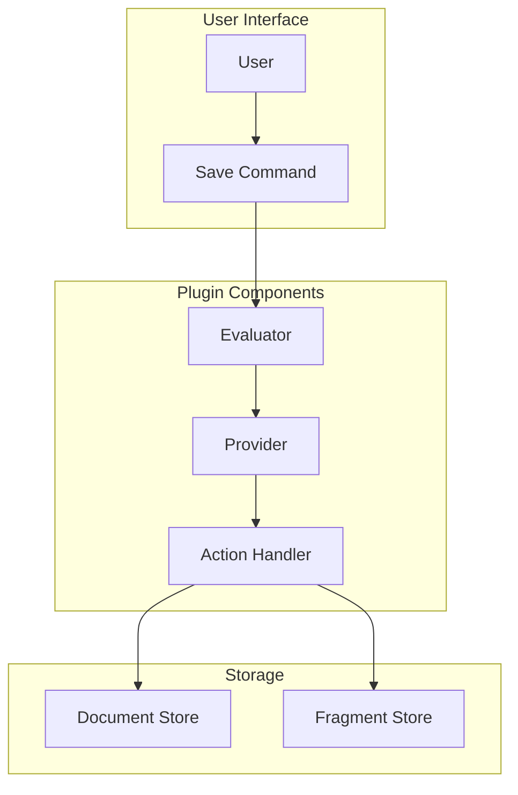
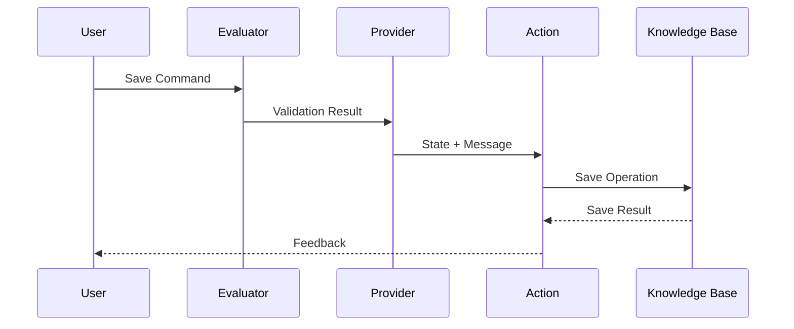
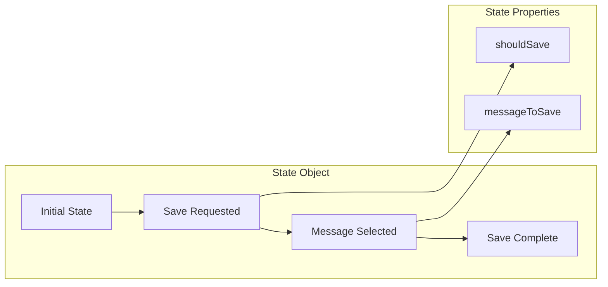

# Save Memory Feature - High Level Design Document

## 1. High Level Design

### 1.1 Overview
The Save Memory feature allows users to persist interesting or important messages from the conversation into a knowledge base for future reference. This document outlines the design and implementation of this feature.

### 1.2 System Components


### 1.3 Component Responsibilities

#### Evaluator
- Validates save memory commands
- Recognizes variations: "save_memory", "save this", "remember this"
- Handles case-insensitive matching
- Returns boolean validation result

#### Provider
- Manages state for save operations
- Sets save flags and message references
- Maintains state consistency
- Interfaces with message manager

#### Action Handler
- Executes save operations
- Retrieves messages from context
- Interfaces with knowledge base
- Handles error conditions
- Generates user feedback

#### Storage Components
- Document Store: Maintains original messages
- Fragment Store: Stores processed/normalized versions

### 1.4 Data Flow


### 1.5 State Management


## 2. Implementation Details

### 2.1 Core Interfaces

```typescript
interface SaveMemoryState {
    shouldSave: boolean;
    messageToSave: Memory;
}

interface Memory {
    id: string;
    text: string;
    user?: string;
    createdAt?: string;
    inReplyTo?: string;
}
```

### 2.2 Component Implementations

#### Evaluator Implementation
```typescript
export const saveMemoryEvaluator: Evaluator = {
    name: "save-memory",
    validate: async (runtime: IAgentRuntime, message: Memory) => {
        const text = message.content?.text?.toLowerCase() || '';
        return text === 'save_memory' ||
               text.includes('save this') ||
               text.includes('remember this') ||
               message.content?.text?.includes('SAVE_MEMORY');
    }
};
```

#### Provider Implementation
```typescript
export const memoryStateProvider: Provider = {
    get: async (runtime: IAgentRuntime, message: Memory, state?: SaveMemoryState) => {
        if (isSaveCommand(message) && state) {
            state.shouldSave = true;
            state.messageToSave = await findMessageToSave(runtime, message);
            return state;
        }
        return state;
    }
};
```

#### Action Handler Implementation
```typescript
export const saveMemoryAction: Action = {
    name: "SAVE_MEMORY",
    handler: async (runtime: IAgentRuntime, message: Memory, state: SaveMemoryState) => {
        if (!state?.shouldSave) {
            return;
        }

        const messageToSave = state.messageToSave;
        await runtime.knowledge.set(messageToSave);
    }
};
```

### 2.3 Key Functions

#### Message Selection
```typescript
async function findMessageToSave(runtime: IAgentRuntime, message: Memory): Promise<Memory> {
    const recentMessages = await runtime.messageManager.getMemories({
        roomId: message.roomId,
        count: 5,
        unique: false
    });

    return recentMessages.find(m => 
        m.agentId === runtime.agentId && 
        m.id !== message.id
    );
}
```

#### State Validation
```typescript
function validateState(state: SaveMemoryState): boolean {
    return state?.shouldSave && 
           state?.messageToSave &&
           state.messageToSave.text !== 'SAVE_MEMORY';
}
```

### 2.4 Error Handling

```typescript
try {
    const result = await runtime.knowledge.set(messageToSave);
    if (!result) {
        throw new Error('Save operation failed');
    }
} catch (error) {
    elizaLogger.error('[Action] handler.error:', error);
    return {
        error: error,
        message: 'Failed to save message to knowledge base'
    };
}
```

### 2.5 Database Schema

#### Documents Table
```sql
CREATE TABLE documents (
    id UUID PRIMARY KEY,
    text TEXT NOT NULL,
    metadata JSONB,
    created_at TIMESTAMP DEFAULT CURRENT_TIMESTAMP
);
```

#### Fragments Table
```sql
CREATE TABLE fragments (
    id UUID PRIMARY KEY,
    document_id UUID REFERENCES documents(id),
    text TEXT NOT NULL,
    embedding VECTOR(1536),
    created_at TIMESTAMP DEFAULT CURRENT_TIMESTAMP
);
```

### 2.6 Configuration

```typescript
export const config = {
    maxRecentMessages: 5,
    saveCommands: ['save_memory', 'save this', 'remember this'],
    errorMessages: {
        saveFailed: 'Sorry, I encountered an error while trying to save that information.',
        noMessage: 'No suitable message found to save.',
        invalidState: 'Invalid state for save operation.'
    }
};
```

This design document provides a comprehensive overview of both the high-level architecture and detailed implementation of the Save Memory feature. It covers component interactions, data flow, state management, error handling, and database schema design.
