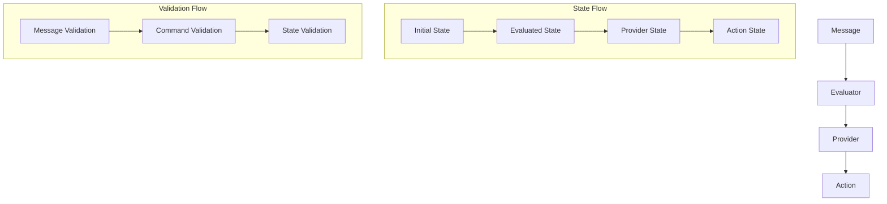
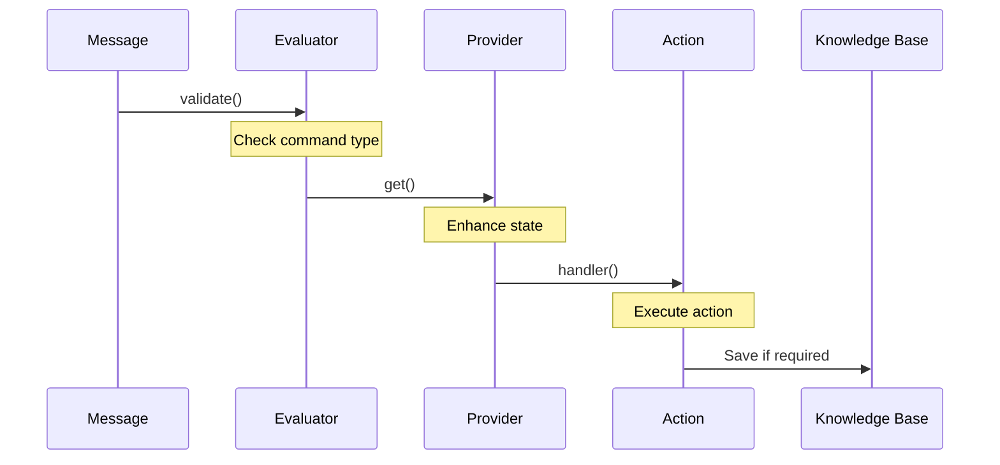
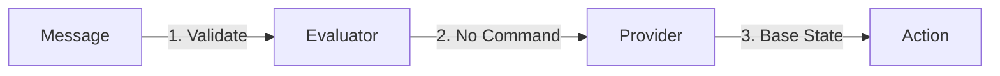
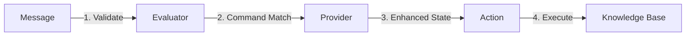
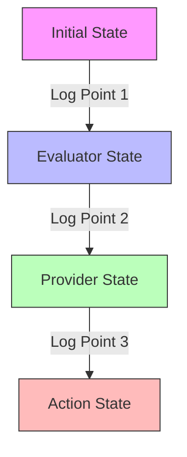
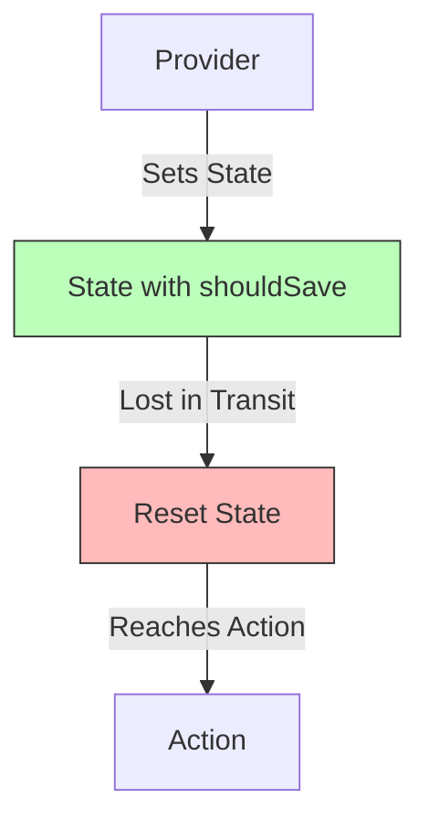
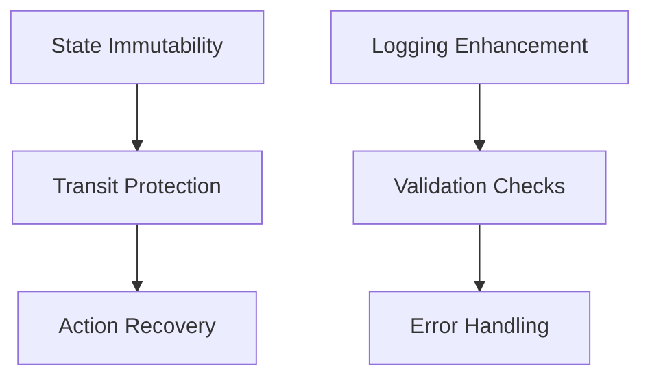

# Save Memory Flow Documentation

## Overview
This document details the execution flow of the save memory functionality in the Database Loader Plugin, including the interaction between Provider, Evaluator, and Action components.

## Component Flow
The execution follows this sequence:
1. Message Received → Evaluator
2. Evaluator → Provider
3. Provider → Action

### Detailed Flow

#### 1. Message Validation (Evaluator)
```typescript
saveMemoryEvaluator.validate(runtime, message)
```
- Logs start of validation with message details
- Checks message text against save patterns:
  - Exact match: "save_memory"
  - Contains: "save this"
  - Contains: "remember this"
  - Case-insensitive: "SAVE_MEMORY"
- Logs validation result with matched text
- Returns Promise<boolean>

#### 2. State Management (Provider)
```typescript
memoryStateProvider.get(runtime, message, state)
```
- Logs initial state and message
- Checks for save commands (same patterns as evaluator)
- If matched:
  - Creates new state with shouldSave=true
  - Adds messageToSave reference
  - Logs state transition
- Returns modified or unchanged state

#### 3. Action Execution (Action)
```typescript
saveMemoryAction.handler(runtime, message, state, options, callback)
```
- Logs action start with message and state
- Validates shouldSave flag in state
- If shouldSave:
  - Retrieves recent messages
  - Identifies message to save
  - Saves to knowledge base
  - Logs success
- If !shouldSave:
  - Logs abort
  - Returns early

## Logging Structure

### Message Logging
```typescript
{
    text: string,
    userId: string,
    roomId: string,
    messageId: string,
    hasContent: boolean
}
```

### State Logging
```typescript
{
    hasState: boolean,
    stateKeys: string[],
    shouldSave?: boolean,
    roomId?: string,
    messageDirection?: string
}
```

## Debug Points

### Key State Transitions
1. **Initial State**: Provider receives base state with agent info
2. **Modified State**: Provider adds shouldSave flag
3. **Action State**: Action receives state with shouldSave flag

### Error Handling
- Circular reference protection in logging
- Safe state summary generation
- Try-catch blocks around logging operations
- Explicit error messages for each failure point

## Example Flow Logs

### Normal Message (No Save)
```
[Evaluator] validate.start - Message: {...}
[Evaluator] validate.result: {result: false, matchedText: "..."}
[Provider] get.start - Message: {...}
[Provider] get.initialState - State: {...}
[Provider] get.unchangedState - State: {...}
```

### Save Memory Command
```
[Evaluator] validate.start - Message: {...}
[Evaluator] validate.result: {result: true, matchedText: "SAVE_MEMORY"}
[Provider] get.start - Message: {...}
[Provider] get.initialState - State: {...}
[Provider] get.newState - State: {shouldSave: true, ...}
[Action] handler.start - Message: {...}
[Action] handler.initialState - State: {shouldSave: true, ...}
```

## Debugging Tips
1. Check evaluator result for command recognition
2. Verify state.shouldSave is set by provider
3. Confirm action receives state with shouldSave
4. Monitor message flow through getMemories
5. Verify knowledge base save operation

## Recent Improvements
1. Added case-insensitive command matching
2. Implemented safe state logging
3. Added messageToSave tracking
4. Enhanced debug logging
5. Improved error handling

## Next Steps
1. Test SAVE_MEMORY command execution
2. Verify state persistence through flow
3. Confirm knowledge base updates
4. Monitor error handling
5. Validate message retrieval

## Annotated Log Analysis

### Regular Message Flow
Here's a breakdown of what happens when a regular message (not a save command) is processed:

```
# 1. Initial Message Creation
◎ LOGS
   Creating Memory
   65b6467c-924f-054c-8ea8-35b95d552354
   <@1319591880886845471>  tell me about new york real estate

# 2. Action Validation
# Checks if message has valid text content
ℹ INFORMATIONS
   [Action] validate.start - Message:
   {"text":"<@1319591880886845471>  tell me about new york real estate","userId":"0f35ffd5-53cf-0d35-86cc-22c63970d07c","roomId":"32e2c347-20ac-0568-b8b0-7bffaae3a93b","hasContent":true}

ℹ INFORMATIONS
   [Action] validate.result:
   {"hasValidText":true,"textLength":58,"text":"<@1319591880886845471>  tell me about new york real estate"}

# 3. Evaluator Check
# Verifies if this is a save memory command - returns false as expected
ℹ INFORMATIONS
   [Evaluator] validate.start - Message:
   {"text":"<@1319591880886845471>  tell me about new york real estate","userId":"0f35ffd5-53cf-0d35-86cc-22c63970d07c","roomId":"32e2c347-20ac-0568-b8b0-7bffaae3a93b","hasContent":true}

ℹ INFORMATIONS
   [Evaluator] validate.result:
   {"result":false,"matchedText":"<@1319591880886845471>  tell me about new york real estate"}

# 4. Provider State Management
# Shows initial state with no shouldSave flag
ℹ INFORMATIONS
   [Provider] get.start - Message:
   {"text":"<@1319591880886845471>  tell me about new york real estate","userId":"0f35ffd5-53cf-0d35-86cc-22c63970d07c","roomId":"32e2c347-20ac-0568-b8b0-7bffaae3a93b","hasContent":true}

# 5. State Contains Core Agent Information
ℹ INFORMATIONS
   [Provider] get.initialState - State:
   {"hasState":true,"stateKeys":["agentId","agentName","bio","lore","adjective","knowledge","knowledgeData","recentMessageInteractions","recentPostInteractions","recentInteractionsData","topic","topics","characterPostExamples","characterMessageExamples","messageDirections","postDirections","senderName","actors","actorsData","roomId","goals","goalsData","recentMessages","recentPosts","recentMessagesData","attachments","discordClient","discordMessage"],"roomId":"32e2c347-20ac-0568-b8b0-7bffaae3a93b"}

# 6. State Remains Unchanged
# No save command detected, so state passes through unmodified
ℹ INFORMATIONS
   [Provider] get.unchangedState - State:
   {"hasState":true,"stateKeys":["agentId","agentName","bio","lore","adjective","knowledge","knowledgeData","recentMessageInteractions","recentPostInteractions","recentInteractionsData","topic","topics","characterPostExamples","characterMessageExamples","messageDirections","postDirections","senderName","actors","actorsData","roomId","goals","goalsData","recentMessages","recentPosts","recentMessagesData","attachments","discordClient","discordMessage"],"roomId":"32e2c347-20ac-0568-b8b0-7bffaae3a93b"}
```

### Key Observations from Logs

1. **Message Processing**
   - Each message gets a unique ID (65b6467c-924f-054c-8ea8-35b95d552354)
   - Message content includes bot mention and actual text

2. **Validation Chain**
   - Action validates message structure
   - Evaluator checks for save command
   - Provider manages state transitions

3. **State Management**
   - Initial state contains rich agent context
   - State remains unchanged for non-save messages
   - roomId is consistently tracked

4. **Expected Behavior Confirmation**
   - Evaluator correctly returns false for non-save message
   - Provider maintains state without modification
   - All components log their operations properly

### What to Look For in Save Command

When testing the SAVE_MEMORY command, we should see:
1. Evaluator.validate returning `true`
2. Provider adding `shouldSave: true` to state
3. Provider preserving existing state keys
4. Action receiving and acting on shouldSave flag

The current logs show the system is correctly handling non-save messages. The next test with SAVE_MEMORY will validate the save path through this flow.

## SAVE_MEMORY Command Analysis

Here's the analysis of what happens during a SAVE_MEMORY command, revealing a state handling issue:

```
# 1. Initial SAVE_MEMORY Command
◎ LOGS
   Creating Memory
   b59e32e6-2826-0343-85fb-8cd54f5ce5b2
   SAVE_MEMORY

# 2. Action Validation - Succeeds
ℹ INFORMATIONS
   [Action] validate.start - Message:
   {"text":"SAVE_MEMORY","userId":"0f35ffd5-53cf-0d35-86cc-22c63970d07c","roomId":"32e2c347-20ac-0568-b8b0-7bffaae3a93b","hasContent":true}

ℹ INFORMATIONS
   [Action] validate.result:
   {"hasValidText":true,"textLength":11,"text":"SAVE_MEMORY"}

# 3. Evaluator Check - Correctly Identifies Save Command
ℹ INFORMATIONS
   [Evaluator] validate.result:
   {"result":true,"matchedText":"save_memory"}

# 4. Provider State Management - ISSUE IDENTIFIED
# Provider correctly adds shouldSave flag
ℹ INFORMATIONS
   [Provider] get.newState - State:
   {"hasState":true,"stateKeys":[..."shouldSave","messageToSave"],"shouldSave":true,"roomId":"32e2347-..."}

# 5. Action Handler - STATE LOSS DETECTED
ℹ INFORMATIONS
   [Action] handler.initialState - State:
   {"hasState":true,"stateKeys":[...],"roomId":"32e2347-..."}

# 6. Action Aborts - Missing shouldSave Flag
["ℹ [Action] handler.abort - Save not requested in state"]
```

### Issue Analysis

1. **State Flow Break**
   - Provider correctly sets `shouldSave: true`
   - Action receives state without `shouldSave` flag
   - State modification is not persisting through the chain

2. **Component Behavior**
   - Evaluator: Correctly identifies SAVE_MEMORY
   - Provider: Correctly modifies state
   - Action: Receives incorrect state
   - State persistence: Fails between Provider and Action

3. **Root Cause Hypothesis**
   - State modifications in Provider aren't being properly passed to Action
   - Possible state reset between Provider and Action execution
   - State management system might be creating new state object

### Required Fixes

1. **State Persistence**
   - Ensure Provider state modifications are immutable
   - Verify state passing mechanism between components
   - Add state transition logging

2. **Action Handler**
   - Add state verification logging
   - Implement state recovery mechanism
   - Consider fallback for missing state flags

3. **System Changes**
   - Review state management system
   - Add state transition guarantees
   - Implement state validation checks

### Next Steps

1. Modify Provider to ensure state changes persist
2. Add state transition logging
3. Implement state validation in Action
4. Test state persistence through entire flow
5. Add recovery mechanisms for lost state

The logs reveal that while each component is working correctly in isolation, there's a critical issue in state persistence between the Provider and Action components that needs to be addressed.

## Deep Dive: Agent Execution Model

### 1. Component Architecture



### 2. State Lifecycle



### 3. Detailed Component Responsibilities

#### 3.1 Message Processing
- **Creation**: Each message gets unique ID
- **Content Structure**:
  ```typescript
  interface Memory {
      content: {
          text: string;
          // Other content fields
      };
      userId: string;
      roomId: string;
      id: string;
      // Other message metadata
  }
  ```

#### 3.2 Evaluator
- **Purpose**: Command recognition and validation
- **Key Methods**:
  ```typescript
  interface Evaluator {
      validate(runtime: IAgentRuntime, message: Memory): Promise<boolean>;
      handler(runtime: IAgentRuntime, message: Memory): Promise<void>;
  }
  ```
- **State Impact**: Minimal - primarily validation
- **Validation Rules**:
  - Command syntax
  - Message structure
  - User permissions

#### 3.3 Provider
- **Purpose**: State management and enhancement
- **Key Methods**:
  ```typescript
  interface Provider {
      get(runtime: IAgentRuntime, message: Memory, state?: State): Promise<State>;
  }
  ```
- **State Modifications**:
  - Command flags (e.g., shouldSave)
  - Context information
  - Message references
- **State Persistence**: Should maintain immutability

#### 3.4 Action
- **Purpose**: Execute commands based on state
- **Key Methods**:
  ```typescript
  interface Action {
      validate(runtime: IAgentRuntime, message: Memory): Promise<boolean>;
      handler(
          runtime: IAgentRuntime,
          message: Memory,
          state: State,
          options: any,
          callback: HandlerCallback
      ): Promise<void>;
  }
  ```
- **State Dependencies**:
  - Command flags
  - Context
  - Previous action results

### 4. State Flow Patterns

#### 4.1 Normal Message Flow


#### 4.2 Command Message Flow


### 5. State Transition Examples

#### 5.1 Base State
```typescript
interface BaseState {
    agentId: string;
    roomId: string;
    // Core agent context
}
```

#### 5.2 Enhanced State (Provider)
```typescript
interface EnhancedState extends BaseState {
    shouldSave?: boolean;
    messageToSave?: Memory;
    // Command-specific enhancements
}
```

### 6. Debugging Points

#### 6.1 State Transitions


#### 6.2 Critical Check Points
1. **Message Entry**
   - Message structure
   - Content validation
   - User context

2. **Evaluator Phase**
   - Command recognition
   - Permission validation
   - Context validation

3. **Provider Phase**
   - State enhancement
   - Context addition
   - Flag setting

4. **Action Phase**
   - State verification
   - Command execution
   - Result handling

### 7. Current Issue Analysis

#### 7.1 State Loss Pattern


#### 7.2 Potential Fix Points


### 8. Development Guidelines

1. **State Management**
   - Always treat state as immutable
   - Use deep copies for modifications
   - Validate state structure at each step

2. **Logging Strategy**
   - Log state transitions
   - Include component entry/exit
   - Track command progression

3. **Error Handling**
   - Validate state before use
   - Provide meaningful error context
   - Implement recovery mechanisms

4. **Testing Approach**
   - Test state transitions
   - Verify command flow
   - Check error recovery

### 9. Future Enhancements

1. **State Validation**
   - Type checking
   - Required field validation
   - State structure verification

2. **Recovery Mechanisms**
   - State reconstruction
   - Command retry logic
   - Error recovery flows

3. **Monitoring Improvements**
   - State transition metrics
   - Command success rates
   - Error pattern detection

This detailed documentation should provide a solid foundation for understanding the agent's execution model and help guide future development and debugging efforts.
