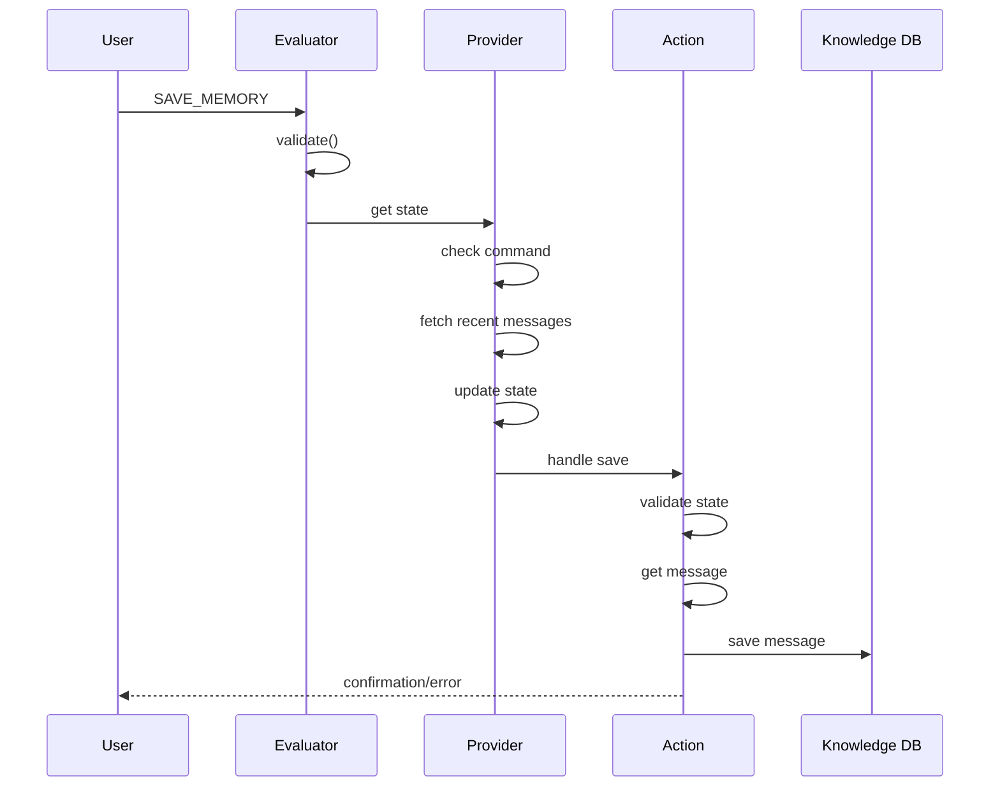
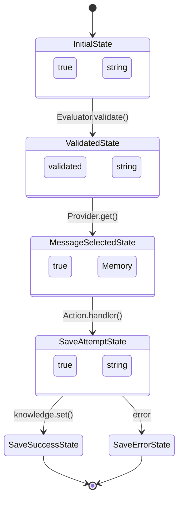
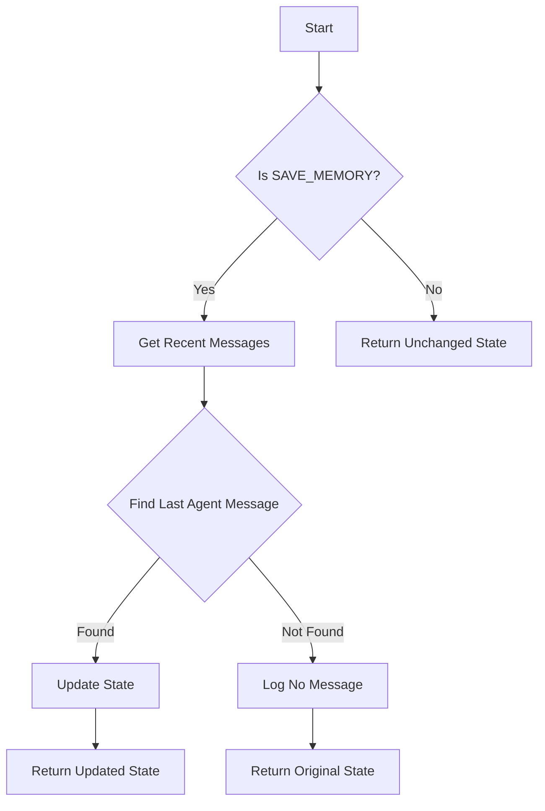
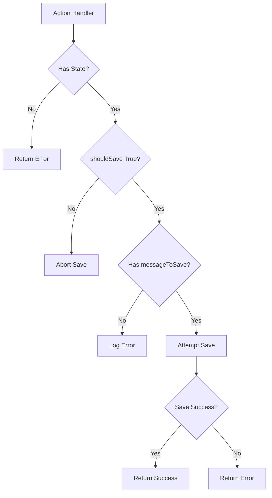
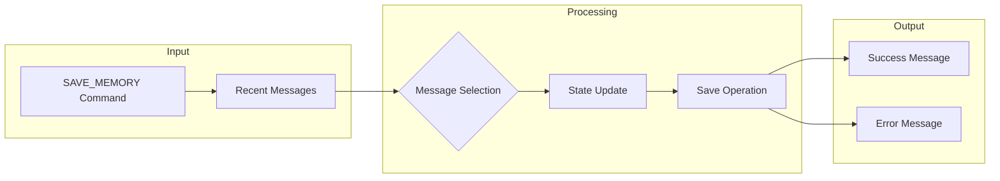
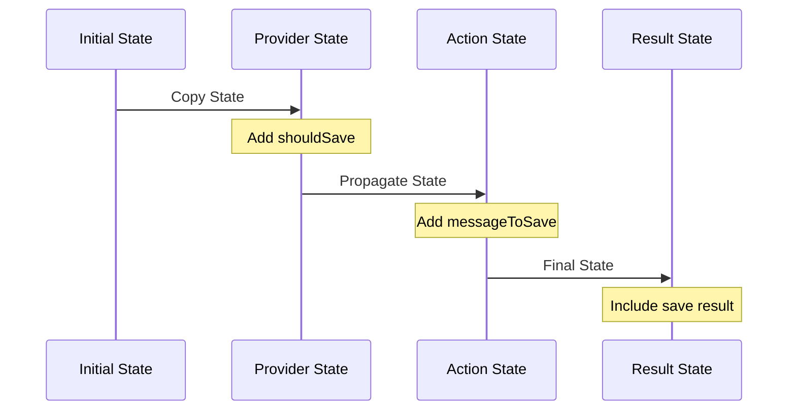
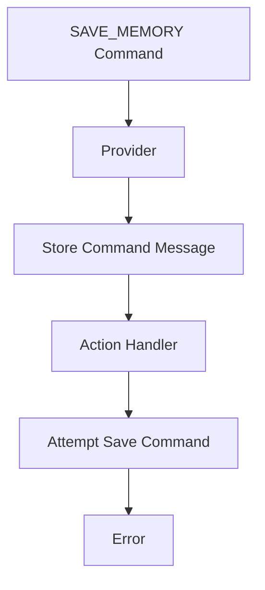
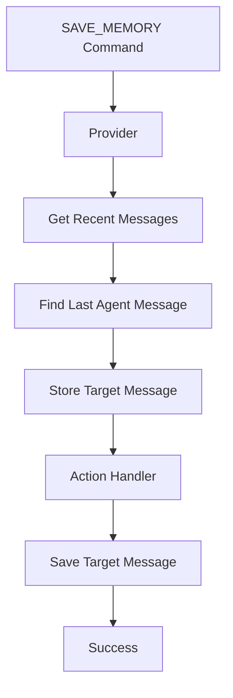

# Save Memory Debug Flow 2

## Overview
This document analyzes the execution flow of the save memory functionality, focusing on state management and the interaction between Provider and Action components.

## Initial Conversation Context
1. User asks about rentals in Goa
2. Bot responds with request for more details
3. User issues SAVE_MEMORY command

## Component Flow Analysis

### 1. Save Command Reception
```typescript
// Incoming message
{
    "text": "SAVE_MEMORY",
    "userId": "0f35ffd5-53cf-0d35-86cc-22c63970d07c",
    "roomId": "32e2c347-20ac-0568-b8b0-7bffaae3a93b",
    "hasContent": true
}
```

### 2. Action Validation
```typescript
[Action] validate.result:
{
    "hasValidText": true,
    "textLength": 11,
    "text": "SAVE_MEMORY"
}
```

### 3. Evaluator Processing
```typescript
[Evaluator] validate.result:
{
    "result": true,
    "matchedText": "save_memory"
}
```

### 4. Provider State Management
#### Initial State
```typescript
[Provider] get.initialState:
{
    "hasState": true,
    "stateKeys": [
        "agentId", "agentName", "bio", /* ... other keys ... */
    ],
    "roomId": "32e2c347-20ac-0568-b8b0-7bffaae3a93b"
}
```

#### Modified State
```typescript
[Provider] get.modifiedState:
{
    "hasState": true,
    "stateKeys": [/* ... */],
    "shouldSave": true,
    "roomId": "32e2c347-20ac-0568-b8b0-7bffaae3a93b"
}
```

### 5. Action Handler Execution
#### Handler State
```typescript
[Action] handler.state:
{
    "hasState": true,
    "shouldSave": true,
    "messageToSave": {
        "text": "SAVE_MEMORY"  // Issue identified: Wrong message being saved
    }
}
```

#### Recent Messages Retrieved
```typescript
[Action] handler.recentMessages:
{
    "count": 4,
    "messages": [
        {
            "id": "4c1110ca-82d1-0e2e-b981-a9233ead66f2",
            "text": "I've stored your request...",
            "user": "ATLAS",
            "createdAt": "2024-12-30T04:22:29.194Z"
        },
        {
            "id": "bb379ec0-79a6-08a8-9544-8cd46fbda034",
            "text": "SAVE_MEMORY",
            "createdAt": "2024-12-30T04:22:25.546Z"
        },
        {
            "id": "75d44f05-301d-04c4-8ef2-cabc5a3937b0",
            "text": "Hello! I'd be happy to help you find rental properties in Goa...",
            "user": "ATLAS",
            "createdAt": "2024-12-30T04:21:47.246Z"
        }
        // ... additional messages
    ]
}
```

## Execution Flow Diagrams

### 1. High-Level Component Flow


### 2. State Transitions


### 3. Message Selection Flow


### 4. Error Handling Flow


### 5. Data Flow


### 6. State Propagation


## Issues Identified

### 1. Message Selection Issue
- Provider was storing the SAVE_MEMORY command instead of the target message
- State contained correct flag (shouldSave: true) but wrong message content

### 2. Message Retrieval
```typescript
[Action] handler.saving:
{
    "messageId": "75d44f05-301d-04c4-8ef2-cabc5a3937b0",
    "messageText": "Hello! I'd be happy to help you find rental properties in Goa...",
    "user": "ATLAS",
    "createdAt": "2024-12-30T04:21:47.246Z"
}
```

### 3. Error Handling
- Action handler encountered an error during save operation
- Generated error response: "Sorry, I encountered an error while trying to save that information."

## Implementation Changes Required

### 1. Provider Message Selection
```typescript
// Previous implementation
state.messageToSave = message;  // Incorrectly stored SAVE_MEMORY command

// Required change
const recentMessages = await runtime.messageManager.getMemories({
    roomId: message.roomId,
    count: 5,
    unique: false
});

const messageToSave = recentMessages.find(m => 
    m.agentId === runtime.agentId && 
    m.id !== message.id
);

state.messageToSave = messageToSave;
```

### 2. State Management
- Maintain state reference instead of creating new state object
- Properly propagate state changes through the component chain

## Testing Recommendations

1. Verify message selection
   - Check that correct previous message is identified
   - Validate message content and metadata

2. State propagation
   - Monitor state object through component chain
   - Verify state modifications persist

3. Error scenarios
   - Test behavior when no previous message exists
   - Validate error handling and user feedback

## Next Steps

1. Implement message selection fix in Provider
2. Add additional logging for state transitions
3. Enhance error handling with specific error types
4. Add validation for message content before save attempt

## Current State vs Desired State

### Current Implementation


### Desired Implementation

