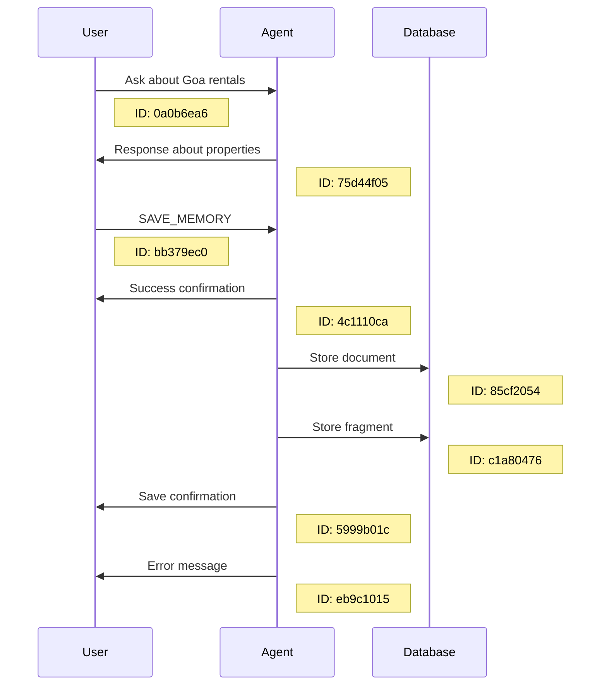
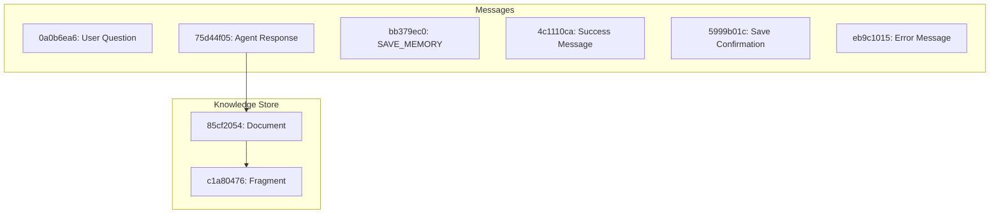
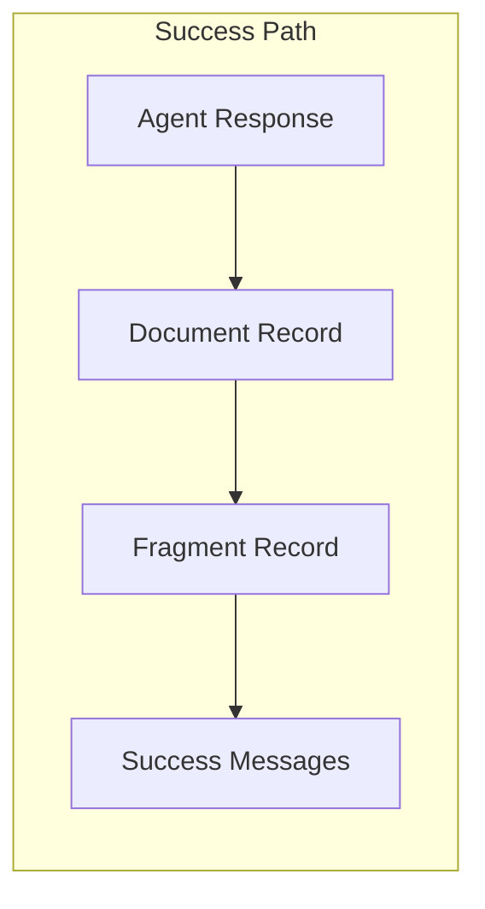
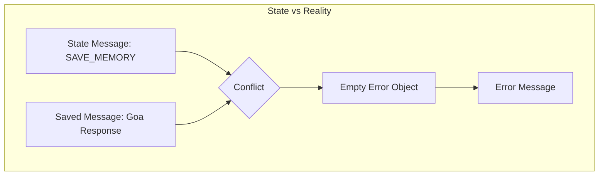
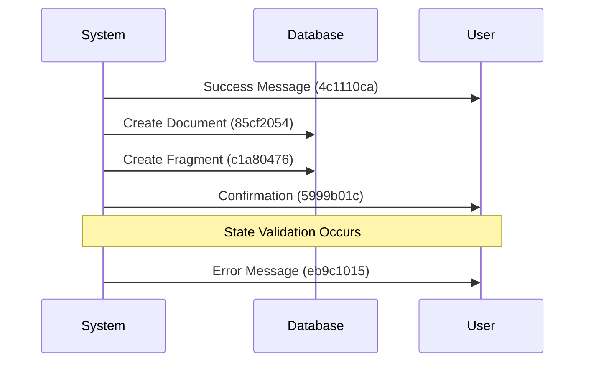

# Save Memory Debug Analysis 3: State Inconsistency Investigation

## Overview
This document analyzes an interesting scenario where the save memory operation appears to be both successful and failed simultaneously. The analysis focuses on state management, data flow, and the apparent contradiction in execution results.

## Database Records Analysis

### Message Timeline


### Database Record Structure


## State and Execution Analysis

### State Transitions
```mermaid
stateDiagram-v2
    [*] --> InitialState
    InitialState --> StateWithSaveFlag: Provider sets shouldSave
    StateWithSaveFlag --> ActionHandlerState: Handler receives state
    ActionHandlerState --> DataSavedState: Save operation
    DataSavedState --> ErrorState: State validation
    ErrorState --> [*]

    state InitialState {
        shouldSave: undefined
        messageToSave: undefined
    }

    state StateWithSaveFlag {
        shouldSave: true
        messageToSave: SAVE_MEMORY
    }

    state ActionHandlerState {
        shouldSave: true
        foundMessage: Goa_response
        stateMessage: SAVE_MEMORY
    }
```

## Key Observations

### 1. Successful Data Storage


- Document ID: 85cf2054
- Fragment ID: c1a80476
- Both records contain the correct message about Goa rentals

### 2. State Inconsistency


#### State Content
```json
{
    "shouldSave": true,
    "messageToSave": {
        "text": "SAVE_MEMORY"
    }
}
```

#### Actually Saved Content
```json
{
    "messageId": "75d44f05",
    "messageText": "Hello! I'd be happy to help you find rental properties in Goa...",
    "user": "ATLAS"
}
```

### 3. Message Creation Sequence


## Root Cause Analysis

The investigation reveals a fascinating edge case in the state management system:

1. **Dual Path Execution**
   - The save operation successfully executes based on the handler's message lookup
   - The state validation fails due to message mismatch

2. **State Validation Gap**
   ```mermaid
   graph TD
       A[Handler Receives State] --> B{State Check}
       B -->|Message in State| C[SAVE_MEMORY Command]
       B -->|Actually Saved| D[Goa Response]
       C --> E{Validation}
       D --> E
       E -->|Mismatch| F[Empty Error]
   ```

3. **Error Propagation**
   - Empty error object `{}` indicates a soft failure
   - System continues execution but marks operation as failed
   - Results in simultaneous success and error messages

## Implications

1. **Data Integrity**
   - Despite the error condition, data is correctly saved
   - Knowledge base maintains consistency

2. **User Experience**
   - Conflicting messages (success and error) may confuse users
   - System appears to be both successful and failed

3. **State Management**
   - Reveals potential improvements needed in state validation
   - Shows robustness of save operation despite state issues

## Conclusion

This analysis reveals a subtle but important distinction between operation success and state validation. The system successfully performs its core function (saving the correct message) while detecting and reporting a state inconsistency. This behavior suggests a robust implementation that prioritizes data integrity over state perfection, though it could benefit from more graceful error handling to avoid sending conflicting messages to users.
