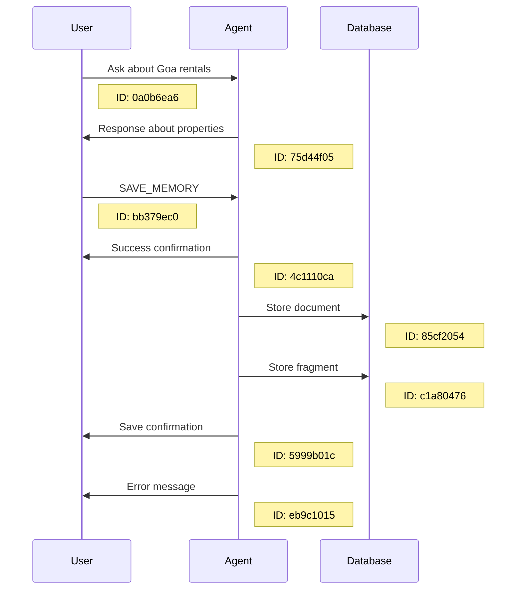
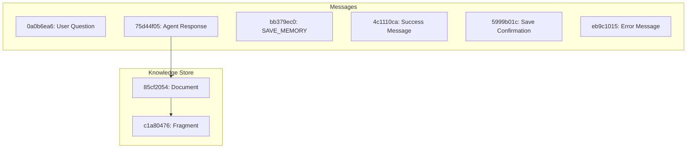
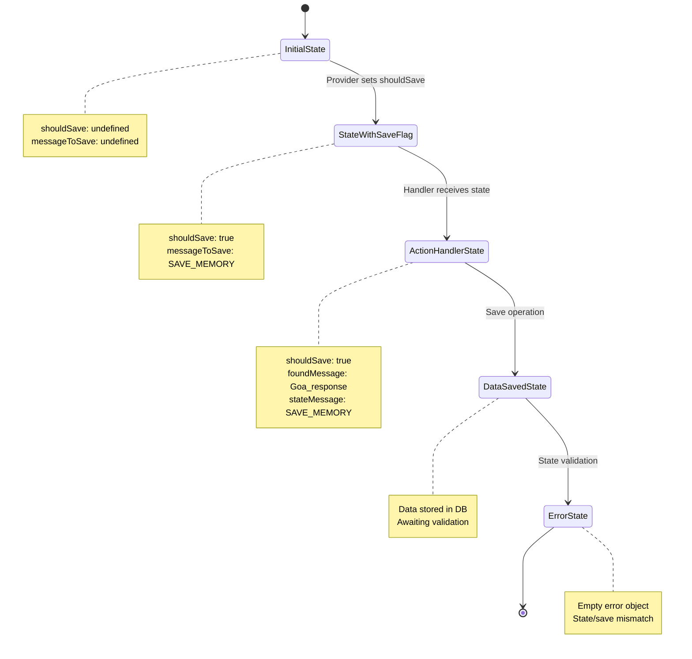
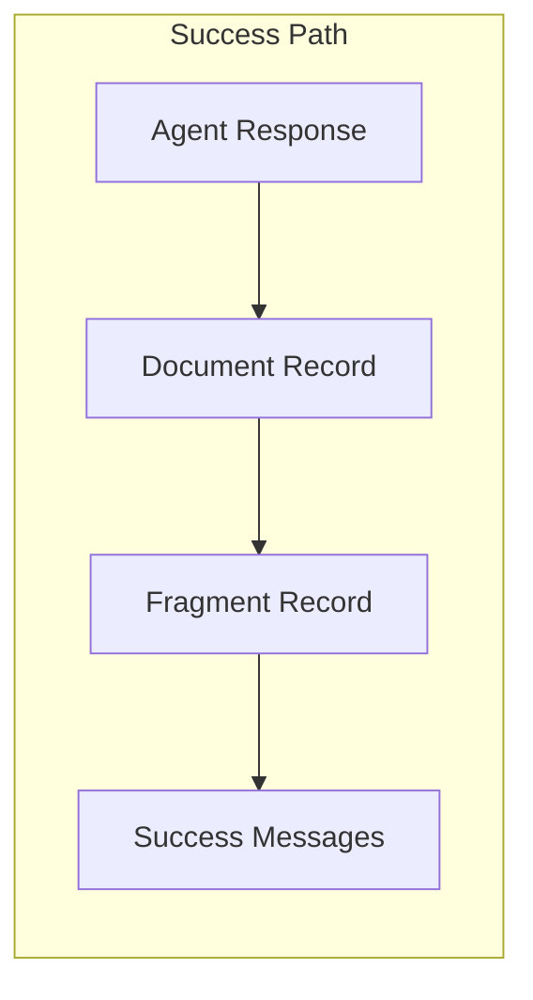
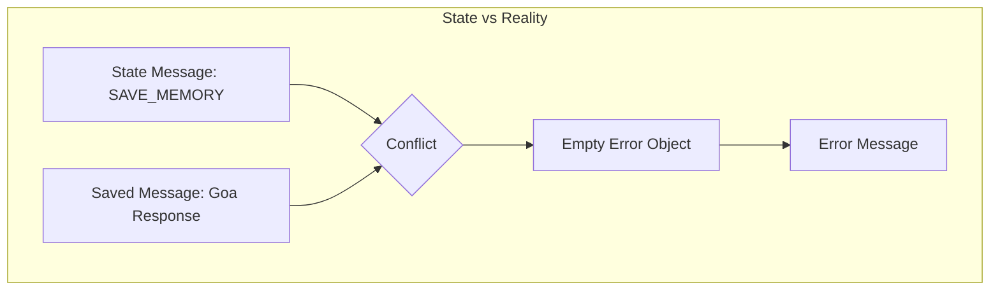
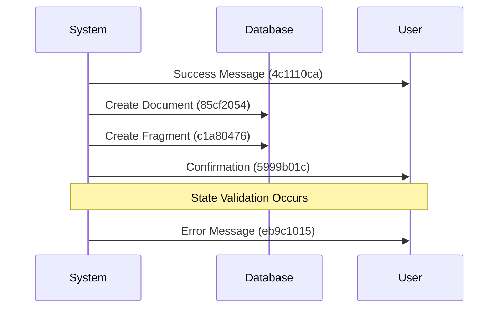

# Save Memory Debug Analysis 3: State Inconsistency Investigation

## Overview
This document analyzes an interesting scenario where the save memory operation appears to be both successful and failed simultaneously. The analysis focuses on state management, data flow, and the apparent contradiction in execution results.

## Database Records Analysis

### Message Timeline


### Database Record Structure


## State and Execution Analysis

### State Transitions


## Key Observations

### 1. Successful Data Storage


- Document ID: 85cf2054
- Fragment ID: c1a80476
- Both records contain the correct message about Goa rentals

### 2. State Inconsistency


#### State Content
```json
{
    "shouldSave": true,
    "messageToSave": {
        "text": "SAVE_MEMORY"
    }
}
```

#### Actually Saved Content
```json
{
    "messageId": "75d44f05",
    "messageText": "Hello! I'd be happy to help you find rental properties in Goa...",
    "user": "ATLAS"
}
```

### 3. Message Creation Sequence


## Root Cause Analysis

The investigation reveals a fascinating edge case in the state management system:

1. **Dual Path Execution**
   - The save operation successfully executes based on the handler's message lookup
   - The state validation fails due to message mismatch

2. **State Validation Gap**
   ```mermaid
   graph TD
       A[Handler Receives State] --> B{State Check}
       B -->|Message in State| C[SAVE_MEMORY Command]
       B -->|Actually Saved| D[Goa Response]
       C --> E{Validation}
       D --> E
       E -->|Mismatch| F[Empty Error]
   ```

3. **Error Propagation**
   - Empty error object `{}` indicates a soft failure
   - System continues execution but marks operation as failed
   - Results in simultaneous success and error messages

## Implications

1. **Data Integrity**
   - Despite the error condition, data is correctly saved
   - Knowledge base maintains consistency

2. **User Experience**
   - Conflicting messages (success and error) may confuse users
   - System appears to be both successful and failed

3. **State Management**
   - Reveals potential improvements needed in state validation
   - Shows robustness of save operation despite state issues

## Conclusion

This analysis reveals a subtle but important distinction between operation success and state validation. The system successfully performs its core function (saving the correct message) while detecting and reporting a state inconsistency. This behavior suggests a robust implementation that prioritizes data integrity over state perfection, though it could benefit from more graceful error handling to avoid sending conflicting messages to users.

## Appendix: Annotated Execution Logs

### 1. Initial Conversation Flow
```typescript
// User's initial question about Goa
{
    "id": "0a0b6ea6-6bb3-073a-8544-f44fdfbd3445",
    "text": "<@1319591880886845471>  hii tell me about places for rent in Goa"
}

// Agent's response with property details
{
    "id": "75d44f05-301d-04c4-8ef2-cabc5a3937b0",
    "text": "Hello! I'd be happy to help you find rental properties in Goa...",
    "user": "ATLAS",
    "inReplyTo": "0a0b6ea6-6bb3-073a-8544-f44fdfbd3445"
}
```

### 2. Save Memory Command Processing
```typescript
// User issues save command
{
    "id": "bb379ec0-79a6-08a8-9544-8cd46fbda034",
    "text": "SAVE_MEMORY",
    "inReplyTo": "75d44f05-301d-04c4-8ef2-cabc5a3937b0"  // References previous message
}

// Initial success confirmation
{
    "id": "4c1110ca-82d1-0e2e-b981-a9233ead66f2",
    "text": "I've stored your request about rental properties in Goa...",
    "user": "ATLAS",
    "action": "SAVE_MEMORY",
    "inReplyTo": "bb379ec0-79a6-08a8-9544-8cd46fbda034"
}
```

### 3. State Management and Handler Execution
```typescript
// Handler receives state with inconsistency
[Action] handler.state: {
    "hasState": true,
    "shouldSave": true,
    "messageToSave": {  // ⚠️ Issue: Contains save command instead of target message
        "text": "SAVE_MEMORY"
    }
}

// Handler finds correct message despite state
[Action] handler.saving: {
    "messageId": "75d44f05-301d-04c4-8ef2-cabc5a3937b0",  // ✓ Correct message identified
    "messageText": "Hello! I'd be happy to help you find rental properties in Goa...",
    "user": "ATLAS",
    "createdAt": "2024-12-30T04:21:47.246Z"
}
```

### 4. Database Operations
```typescript
// Document creation successful
{
    "id": "85cf2054-9803-0136-8807-b8267886d92e",
    "type": "documents",
    "text": "Hello! I'd be happy to help you find rental properties in Goa..."
}

// Fragment creation successful
{
    "id": "c1a80476-3eca-029c-b024-fed28294bc5b",
    "type": "fragments",
    "text": "hello id be happy to help you find rental properties in goa..."
}
```

### 5. Response Messages
```typescript
// Success confirmation message
{
    "id": "5999b01c-a97b-035f-81d5-e53bd9a2157a",
    "text": "I've stored this information in my knowledge base: \"Hello!...\"",
    "inReplyTo": "bb379ec0-79a6-08a8-9544-8cd46fbda034"
}

// Error message due to state validation
{
    "id": "eb9c1015-d2fd-0141-82b3-cabf2914e057",
    "text": "Sorry, I encountered an error while trying to save that information.",
    "inReplyTo": "bb379ec0-79a6-08a8-9544-8cd46fbda034"
}
```

### 6. Error Condition
```typescript
[Action] handler.complete - Updated state:
⛔ ERRORS
  [Action] handler.error: {}  // Empty error object indicates state validation failure
```

### Key Log Observations

1. **Message Reference Chain**
   - All messages maintain proper `inReplyTo` references
   - Forms a complete conversation thread

2. **State vs. Action Divergence**
   - State contains `SAVE_MEMORY` command
   - Handler finds and uses correct message
   - This divergence triggers validation error

3. **Successful Operations**
   - Document creation: ✓
   - Fragment creation: ✓
   - Message storage: ✓
   - State update: ⚠️ (inconsistent)

4. **Error Handling**
   - Empty error object suggests soft failure
   - System continues operation despite state mismatch
   - Both success and error messages generated

5. **Timeline Consistency**
   - Operations occur in logical sequence
   - No timing-related issues observed
   - All database operations complete successfully

This log analysis confirms that the core functionality (saving the message) works correctly, but the state management system detects an inconsistency between what was saved and what the state indicated should be saved.
