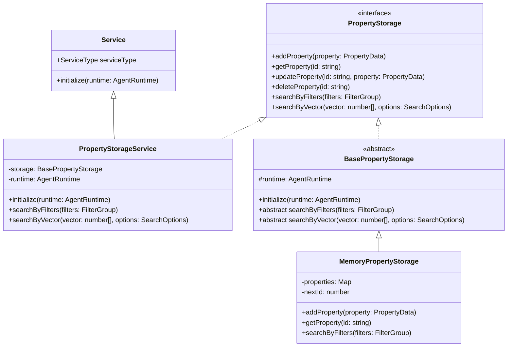
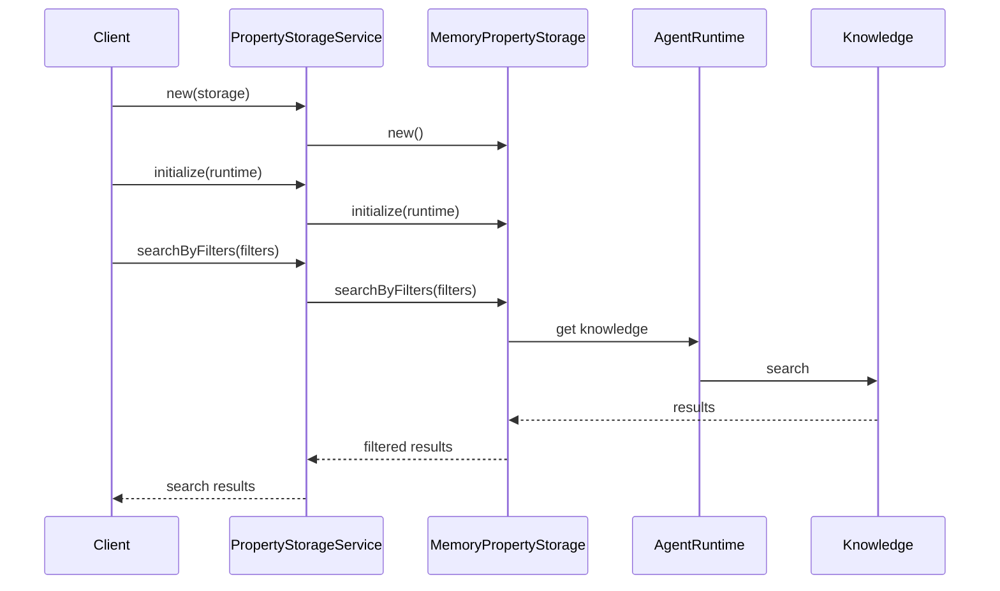
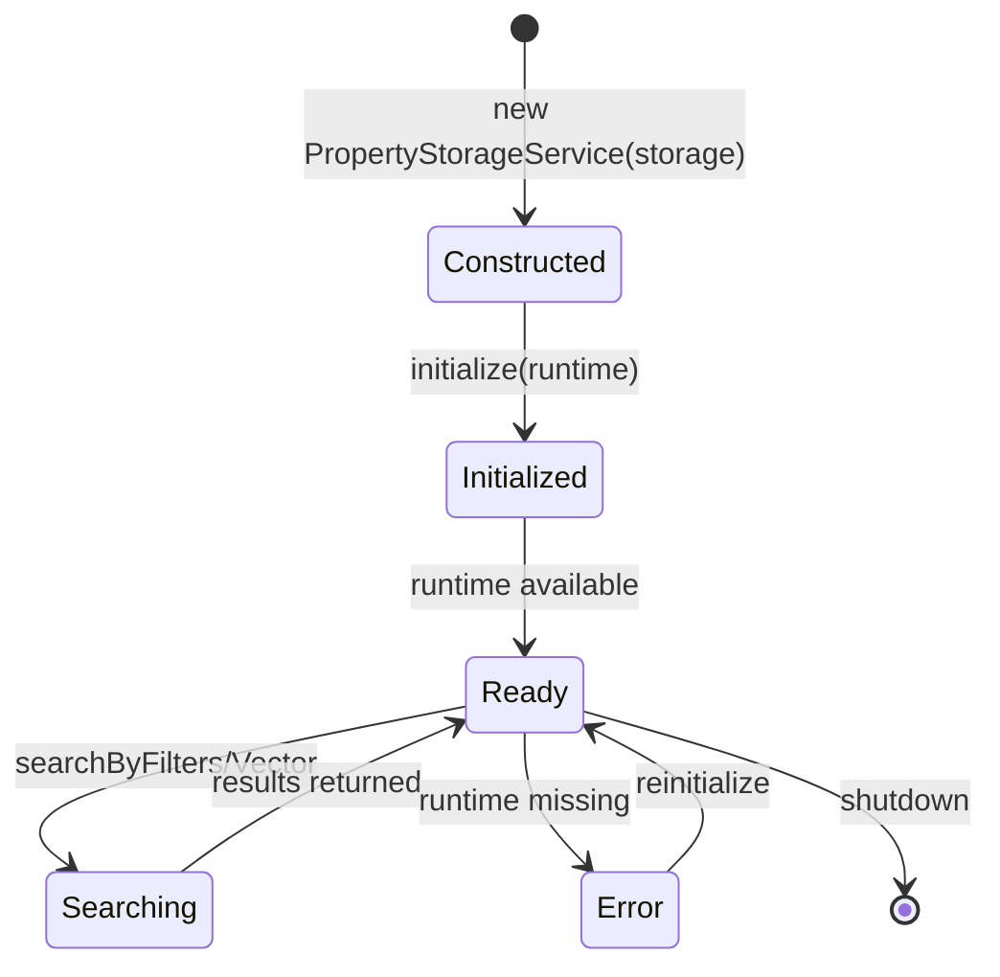
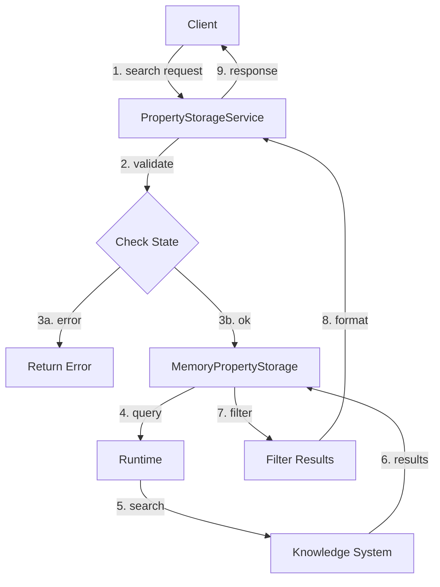
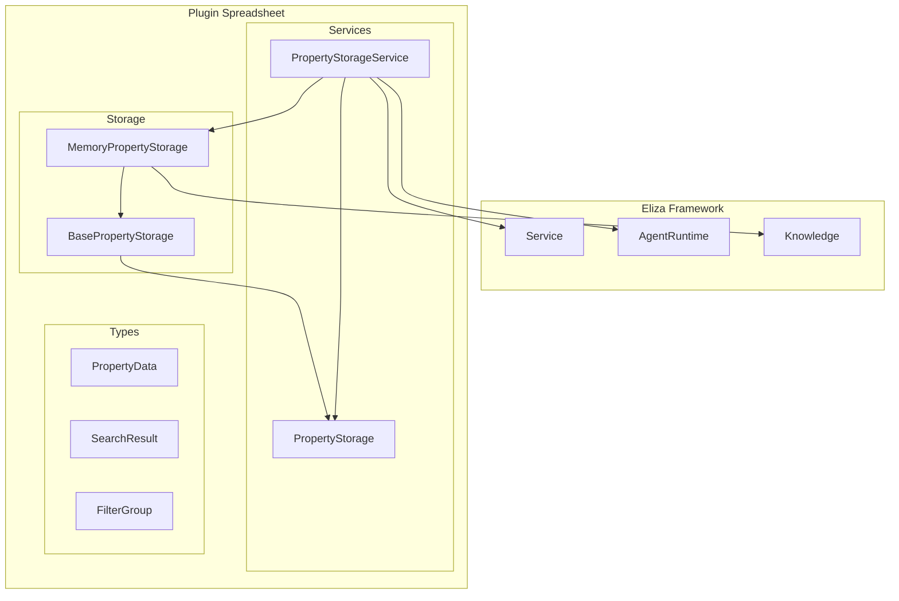
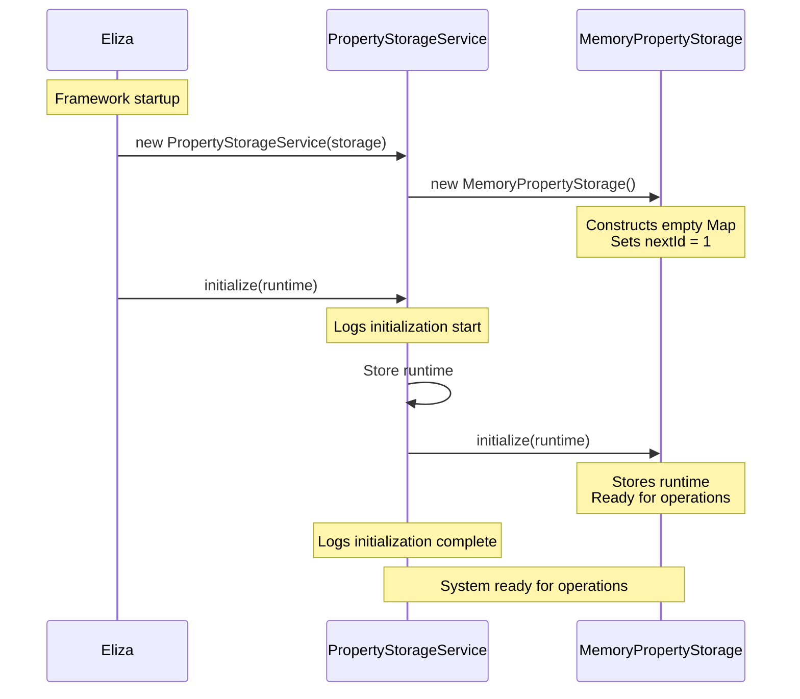
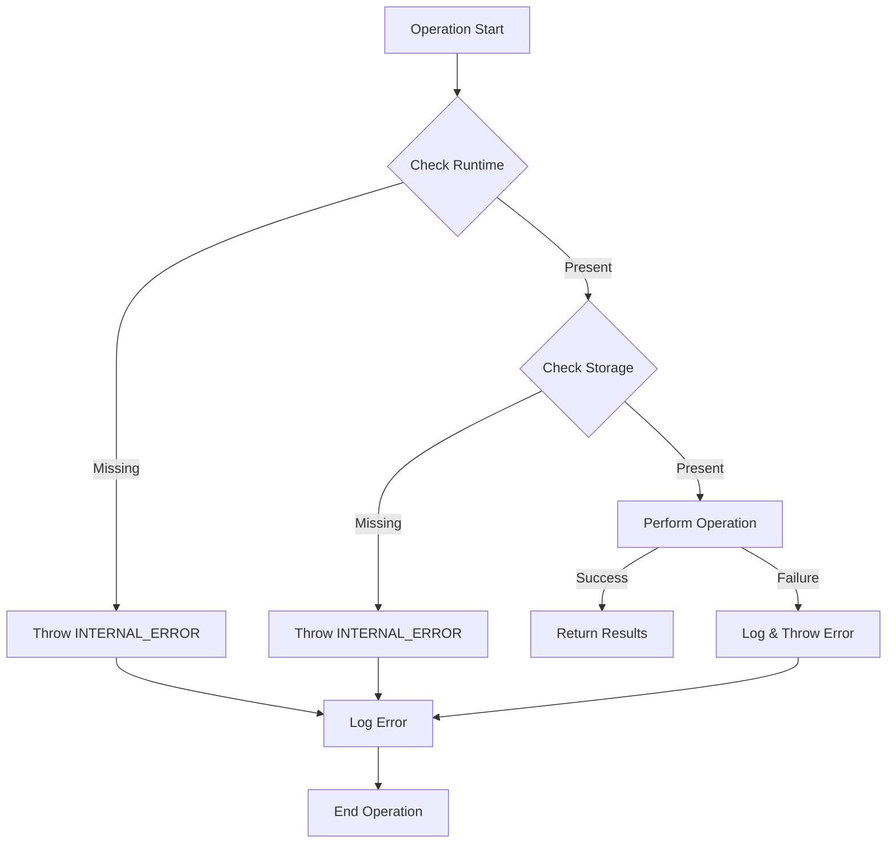

# Property Storage Architecture Diagrams

## Class Hierarchy

## Component Interaction

## Runtime State Flow

## Data Flow

## Component Architecture

## Initialization Flow

This diagram shows the initialization sequence from framework startup to ready state.

## Error Handling Flow

These diagrams show different aspects of the property storage system:

1. **Class Hierarchy**: Shows the inheritance and implementation relationships between classes
2. **Component Interaction**: Illustrates how the different components communicate during operations
3. **Runtime State Flow**: Shows the different states a PropertyStorageService instance can be in
4. **Data Flow**: Demonstrates how data moves through the system during a search operation
5. **Component Architecture**: Shows how the components fit into the larger system
6. **Initialization Flow**: Shows the initialization sequence from framework startup to ready state
7. **Error Handling Flow**: Illustrates how errors are handled throughout the system

Each diagram provides a different perspective on how the system works, making it easier to understand the overall architecture and individual component responsibilities.
