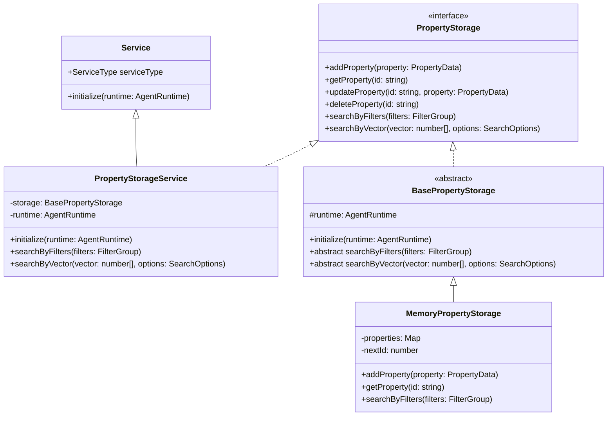
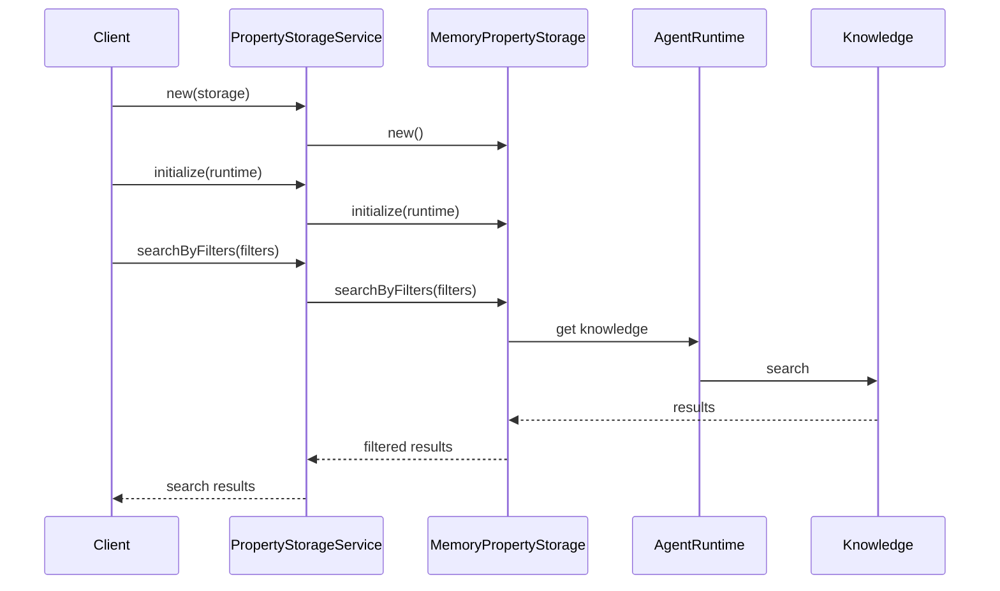
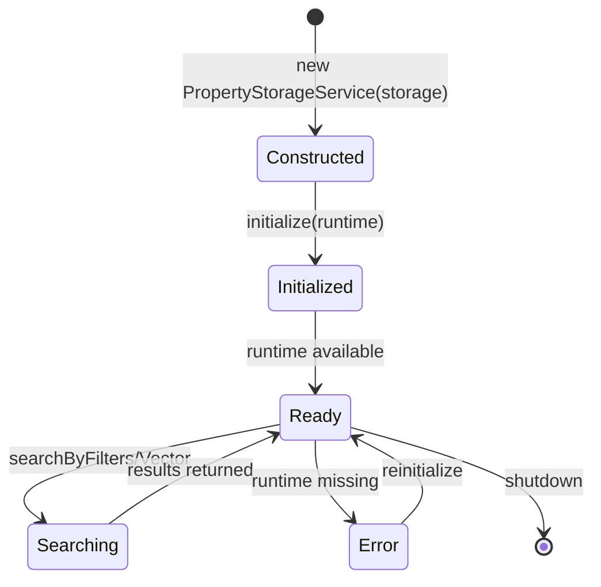
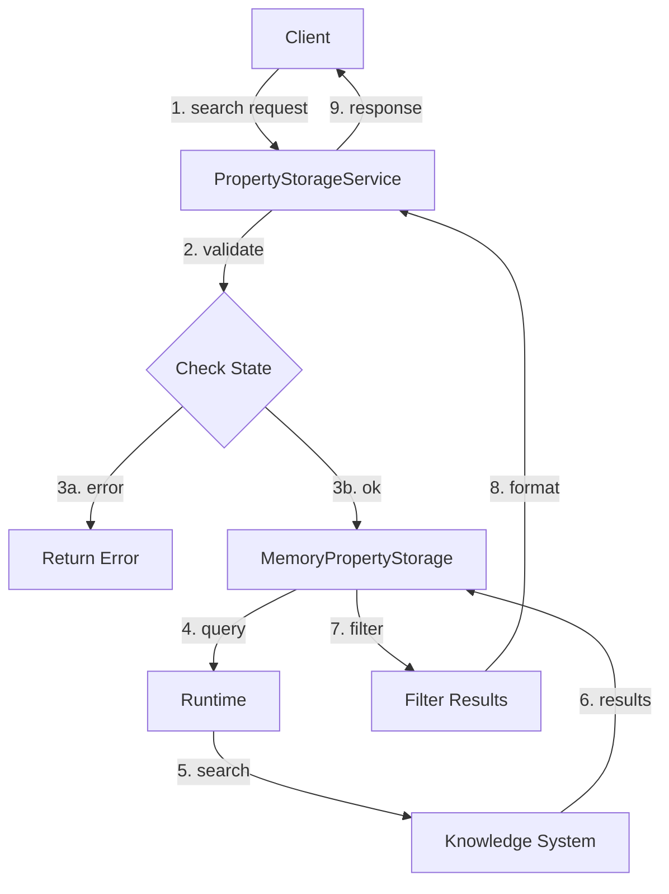
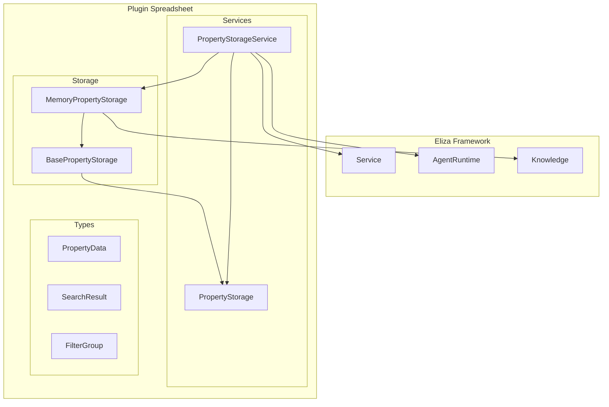
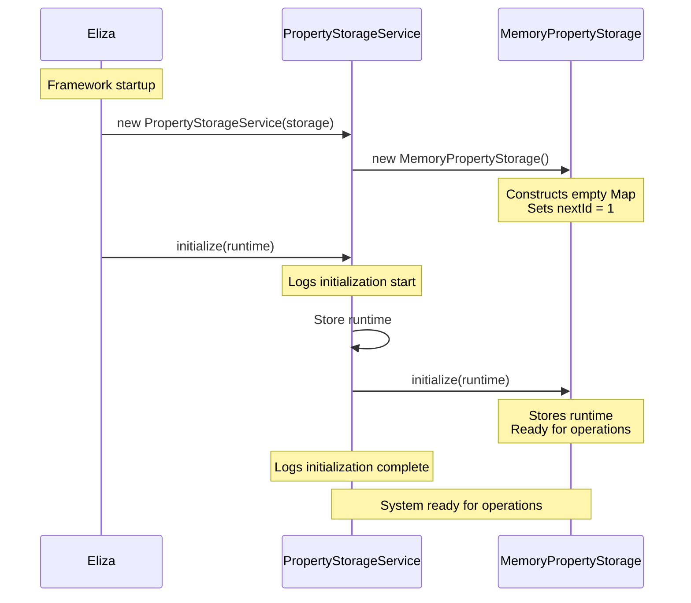
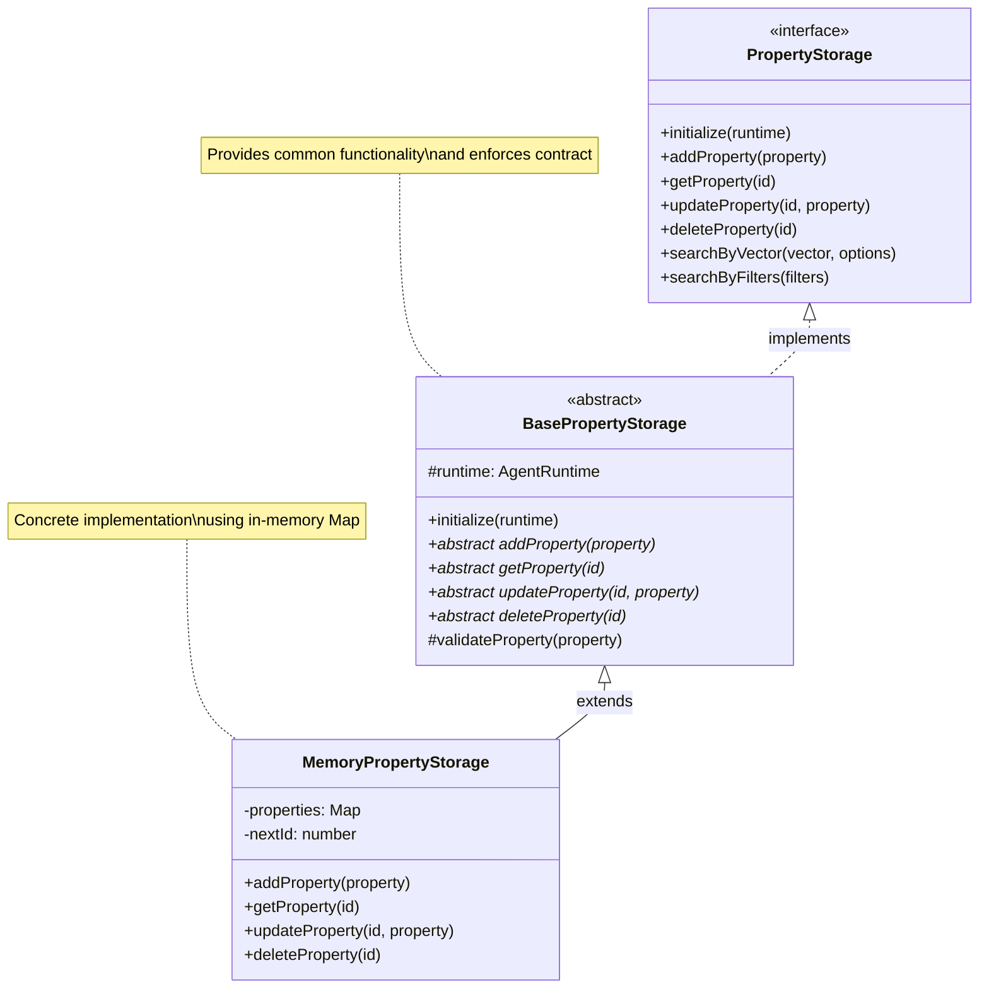
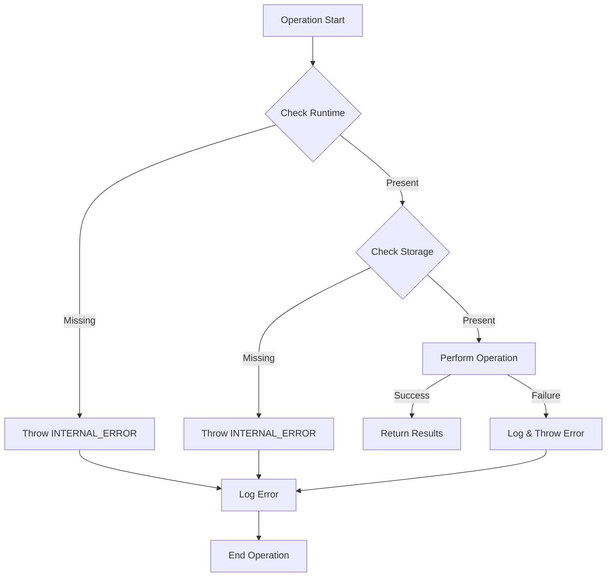
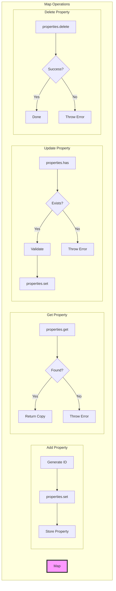

# Property Storage Architecture Diagrams

## Class Hierarchy

## Component Interaction

## Runtime State Flow

## Data Flow

## Component Architecture

## Initialization Flow

## Abstract Class Structure

## Error Handling Flow

## Map Operations

The Map in [MemoryPropertyStorage](cci:1://file:///home/kai/eliza/eliza/packages/plugin-spreadsheet/src/storage/memory-storage.ts:8:0-172:1) provides these key operations:

1. **Set**: `properties.set(id, property)`
   - Stores or updates a property with a given ID
   - Example: `properties.set("1", { id: "1", name: "Property 1" })`

2. **Get**: `properties.get(id)`
   - Retrieves a property by ID
   - Returns undefined if not found
   - Example: `properties.get("1")`

3. **Has**: `properties.has(id)`
   - Checks if a property exists
   - Example: `if (properties.has("1")) { ... }`

4. **Delete**: `properties.delete(id)`
   - Removes a property
   - Returns true if successful
   - Example: `properties.delete("1")`

5. **Entries**: `properties.entries()`
   - Gets all properties for iteration
   - Example: `Array.from(properties.entries())`

These diagrams show different aspects of the property storage system:

1. **Class Hierarchy**: Shows the inheritance and implementation relationships between classes
2. **Component Interaction**: Illustrates how the different components communicate during operations
3. **Runtime State Flow**: Shows the different states a PropertyStorageService instance can be in
4. **Data Flow**: Demonstrates how data moves through the system during a search operation
5. **Component Architecture**: Shows how the components fit into the larger system
6. **Initialization Flow**: Shows the initialization sequence from framework startup to ready state
7. **Abstract Class Structure**: Shows the relationship between the interface, abstract class, and concrete implementation
8. **Error Handling Flow**: Illustrates how errors are handled throughout the system
9. **Map Operations**: Shows the operations performed on the Map in MemoryPropertyStorage

Each diagram provides a different perspective on how the system works, making it easier to understand the overall architecture and individual component responsibilities.
